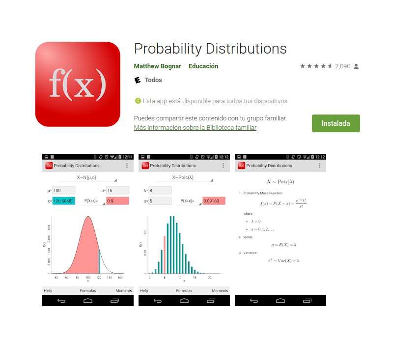

---
title: <span style="color:#235784"> </span>  
subtitle: <span style="color:#235784">**Unidad 2.4**</span> 
author: "dgonzalez "
output:
  html_document:
    toc: no
    toc_depth: 2
    toc_float: yes
    code_folding: hide
    theme: flatly
    css: style.css
---     

```{r setup, include=FALSE}
knitr::opts_chunk$set(echo = TRUE, message = FALSE, warning = FALSE, comment = NA)
library(psych)
library(summarytools)
library(tidyverse)
# install.packages("devtools")
#devtools::install_github("dgonxalex80/paqueteDEG")
#library(paqueteDEG)

# colores
c0= "#FFCC00"
c1= "#FFAD42"
c2= "#FF5A42"
c3= "#E1286F"
c4= "#4983F6"
c5= "#783AC7"
c6= "#2C5697" # AZZUL INSTITUCIONAL
c7= "#F7F7F7" # FONDO GRIS CLARO WEB

# install.packages('gtools')
# install.packages("TeachingSampling")

#load library
#library(gtools)
#library(TeachingSampling)
#library(readr)
#base_muestreo <- read_delim("data/base_muestreo.csv", 
#    delim = ";", escape_double = FALSE, col_types = cols(ID = col_integer()), 
#    trim_ws = TRUE)


```

```{r, echo=FALSE, out.width="100%", fig.align = "center"}

```

<br/><br/>

# **Funciones modelos**

<br/><br/>

#### **Código R**

Existe un grupo de modelos identificados para las variables aleatorias tanto discretas como continuas que son utilizadas con frecuencia en diferentes contextos. A continuación se relacionan los principales modelos:

<br/><br/>

#### **Modelos discretos**:

+ Bernoulli, 
+ binomial,
+ Poisson,
+ geometrico,
+ hipergeometrico,
+ binomial negativo.

<br/><br/>

#### **Modelos continuos**:

+ uniforme
+ normal
+ exponencial
+ lognormal
+ gamma
+ beta
+ Weibull
+ Cauchy
+ Gumbel
+ t-Student
+ Ji-cuadrado
+ F de Fisher
+ Empirica o  Kernel

<br/><br/>

En $R$ los nombre de las funciones diseñadas para los cálculos requeridos están conformadas por dos partes:

La primera parte es una letra que identifica el propósito de la función.
<br/><br/>

+ *d* : función de distribución de probabilidad $f(x)= P(X=x)$, para el caso discreto. En el caso de las variables continuas representa la función de densidad de probabilidad $f(x)$

+ *p* : función de probbilidad acumulada $F(x) = P(X \leq x)$

+ *q* : percentil $X_p$

+ *r* : generador de números aleatorios

<br/><br/>

La siguiene tabla presenta estas las funciones para los principales modelos tanto discretos como continuos

<br/><br/>


*modelo*            |  $F(x)$  |  $X_{p}$ |  $f(x)$  | aleatorio   |
--------------------|----------|----------|----------|-------------|
binomial            | pbinom   | qbinom   | dbinom   | rbinom      |
gometrico           | pgeom    | qgeom    | dgeom    | rgeom       |       
hipergeometrico     | phyper   | qhyper   | dhyper   | rhyper      |
Poisson             | ppois    | qpois    | dpois    | rpois       |
binomial negativo   | pnbinom  | qnbinom  | dnbionom | rnbinom     |      
beta                | pbeta    | qbeta    | dbeta    | rbeta       |
Cauchy              | pcauchy  | qcauchy  | dcauchy  | rcauchy     |
exponencial         | pexp     | qexp     | dexp     | rexp        |
gamma               | pgamma   | qgamma   | dgamma   | rgamma      |
lognormal           | plnorm   | qlnorm   | dlnorm   | rlnorm      |
uniforme            | punif    | qunif    | dunif    | runif       |
Weibull             | pweibull | qweibull | dweibull | rweibull    |
t-Student           | pt       | qt       | dt       | rt          |
Ji-cuadrado         | pchisq   | qchisq   | dchisq   | rchisq      |
F                   | pf       | qf       | df       | rf          |

<br/><br/>

En **R** los nombres de las funciones diseñadas para los cálculos requeridos están conformadas por dos partes: la primera parte con el propósito de la función (primera letra)  y la segunda parte hace referencia al modelo a utilizar (**d** **binom** para el calculo de probabilidad de una variable aleatoria con distribución binomial)

En cada caso si no recuerda las sintaxis de la función puede hacer uso de las ayudas de R así:

<br/><br/>

```{r}
 help("pbinom")
```

<br/><br/>

|          |                                           |
|:--------:|:------------------------------------------|
|	p        | función de distribución acumulada $F(x)$  |
|	q        | percentil                                 |  
|	d        | densidad de probabilidad $P(X=x)$         |
|	r        | variable aleatoria                        |

<br/><br/>

<br/><br/>

<div class="box2 with-label">
<div class="label">Ejemplo 1</div>

Sea una variables con distribución binomial con parámetros $n=20$ y $p=0.30$ , lo cual se puede simbolizar como : $X\sim b(x; 20,0.30)$


En este caso se requieren realizar los siguientes procesos:

1. Calcular la probabilidad de $P(X=7)$
2. Calcular la probabilidad acumulada $P(X \leq 7)$
3. Construir la tabla de los  valores de $f(x)$ y $F(x)$ para todo el rango de la variable
4. Generar 15 números aleatorios a partir de esta distribución 
5. Construir la gráfica de la función de distribución de probabilidad $f(x)$ para $X$ 
6. Construir la gráfica de la función de distribución acumulada   $F(x)$

</div>

<br/><br/><br/>

### **Solución**

1. Calcular la probabilidad de $$ P(X=7) = \dbinom{20}{7} 0.30^{7} (10.30)^{(20-7)}$$

```{r}
dbinom(7, 20, 0.30)
```

<br/>

2. Calcular la probabilidad acumulada $$P(X \leq 7) = \displaystyle\sum_{x=0}^{x=7} \dbinom{20}{x} 0.30^{x} (1-0.30)^{(20-x)}$$

```{r}
pbinom(7, 20, 0.30)
```

<br/>

3. Construir la tabla de los  valores de $f(x)$ y $F(x)$ para todo el rango de la variable

```{r}
x=0:20                     # genera secuencia 0 al 20
fx=dbinom(x, 20, 0.30)     # evalua f(x)
fx=round(fx,4)             # redondea a 4 decimales
Fx=pbinom(x, 20, 0.30)     # evalua en F(x)
Fx=round(Fx,4)             # redondea a 4 decimales
data.frame(x,fx,Fx)        # construye tabla
```

<br/>

4. Generar 15 números aleatorios a partir de esta distribución 

```{r}
rbinom(15,20,0.30)
```

<br/>

5. Construir la gráfica de la función de distribución de probabilidad $f(x)$ para $X$ 

```{r, fig.align='center'}
plot(x,dbinom(x,20,0.30), pch=19,las=1,  
	ylab="f(x)", col=c3)
grid()
```

<br/>

6. Construir la gráfica de la función de distribución acumulada   $F(x)$


```{r, fig.align='center'}
x=0:20
	plot(x,pbinom(x,20,0.30), pch=19, "s",las=1,
	ylab="f(x)", col=c3)
```

<br/>

$f(x)$
```{r, fig.align='center'}
library(ggplot2)
x=0:20
fx=dbinom(x,20,0.30)
dat=data.frame(x,fx)
	
ggplot(dat) + geom_point(aes(x, fx),colour = c3, size = 2) +
       	scale_x_continuous(limits = c(0, 20),
	      breaks = 0:20, 
      	labels = c('0','1','2','3','4','5','6','7','8','9','10','11','12','13','14', '15','16','17','18','19','20'))
```


<br/><br/><br/>

<br/><br/>

<div class="box2 with-label">
<div class="label">Ejemplo 2</div>

Ahora supongamos que se tiene una variable continua con distribución normal, con media 50 y varianza 100, es decir desviación estándar 10, lo cual se puede representar como $X\sim N(50,100)$.  

En este caso vamos a hallar los siguientes valores: 

<br/>

1. Calcular la probabilidad de que un valor de $X$ sea menor o igual a 70, 
2. Calcular la probabilidad de que la variable sea mayor a 70: $P(X>70)$
3. Genere 10 números aleatorios de la variables $X$
4. Generar la gráfica de la función de densidad de la variable $X$,  $f(x)$
5. Generar la gráfica de la función de probabilidad acumulada de la variable $X$,  $F(x)$

</div>

<br/><br/><br/>

### **Solución**

<br/>

1. Calcular la probabilidad de que un valor de $X$ sea menor o igual a 70, 

$$
P(X<70) =\displaystyle\int_{-\infty}^{70} \dfrac{1}{\sqrt{200 \pi }} \exp{\frac{1}{200 }(x-50)^{2}} \:dx
$$ 

```{r}
 pnorm(70,50,sqrt(100))
```

<br/>

2. Calcular la probabilidad de que la variable sea mayor a 70: $P(X>70)$

```{r}
pnorm(70,50,sqrt(100),lower.tail=FALSE)
```

<br/>

3. Genere 10 números aleatorios de la variables $X$


```{r}
rnorm(10,70,sqrt(100))
```


<br/>

4. Generar la gráfica de la función de densidad de la variable $X$,  $f(x)$

```{r, fig.align='center'}
curve(dnorm(x,50,sqrt(100)), from=20, to=80, 
col=c3, main="Distribución Normal(50,100)",
ylab="f(x)", las=1)
```

<br/>

5. Generar la gráfica de la función de probabilidad acumulada de la variable $X$,  $F(x)$

```{r, fig.align='center'}
curve(pnorm(x,50,sqrt(100)), from=20, to=80, 
col=c3, main="Distribución Normal(50,100)",las=1,
ylab="f(x)")
```

<br/><br/>

### **Código**

```{r, fig.align='center'}
# install.package("ggfortify")
library(ggfortify)
ggdistribution(dnorm, seq(-4, 4, 0.1), mean = 0, sd = 1,fill = c4)
```

```{r, fig.align='center'}
# install.package("ggfortify")
library(ggfortify)
ggdistribution(pnorm, seq(-4, 4, 0.1), mean = 0, sd = 1)
```

<br/><br/><br/>


# **App Probability Distributions** 

Esta aplicación permite calcular probabilidades desde el celular



