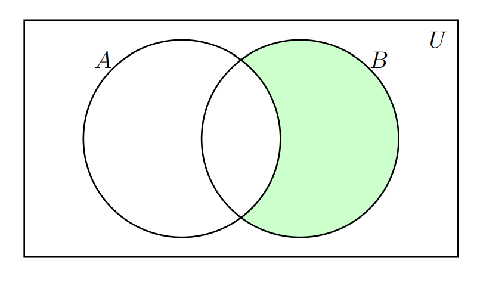

---
title: <span style="color:#235784"> **Conjuntos**</span>  
author: "dgonzalez "
subtitle: <span style="color:#235784">**Módulo 0**</span> 
output:
  html_document:
    toc: no
    toc_depth: 2
    toc_float: yes
    code_folding: hide
    theme: flatly
    css: style.css
---  
```{r setup, include=FALSE}
knitr::opts_chunk$set(echo = TRUE,comment = NA)


```


<br/><br/>

# **Introducción** 

A continuación se relacionan las principales características de los conjuntos y sus principales relaciones. Estos conceptos serán importante en el momento de abordar los conceptos básicos de  probabilidad que serán expuestos en el Modulo 2. 

En pesaremos con su definición

<br/><br/>

<div class="highlight-box">
# **Conjunto**

Un conjunto es una colección de objetos que se denota con una letra mayúscula (comúnmente las primeras letras del alfabeto A,B,C..) . 

</div>

<br/><br/><br/>

Se pueden escribir por:

+ **por extensión** :  $A=\{0,1,2,3,4,5,6,7,8,9\}$, escribiendo todos los elementos que lo conforman.
 
+ **por su nombre** : los dígitos

+ **por compresión** : $A=\{ x\in\mathbb{Z},  0\le x  \le 9    \}$, utilizando  nomenclatura matemática.

Al  comparar o combinar conjuntos debemos hacer uso de sus propiedades y operaciones, dentro de  las  cuales se encuentran $A \cup B$, $A \cap B$, 

<br/><br/><br/>

# **Unión del conjunto**

Unión del $A$ con el conjunto $B$.\hspace{.4cm} $A \cup B$, $\overline{A}$ ,$A - B$, entre  otras. La zona sombreada en la siguiente figura representa estas operación

{width=50%}


<div class="box1 with-label">
<div class="label">Ejemplo 1</div>

Supongamos los siguientes conjuntos  

* $A = \{a,e,i,o,u \}$ y      
* $B = \{1,2,3,4,5,6,7,8,9,0\}$ 

$$A \cup B = \{a,e,i,o,u, 1,2,3,4,5,6,7,8,9,0 \}$$  
 
 </div>
 
<br/><br/><br/>

# **Intersección** 

La intersección entre el conjunto $A$ y el $B$ se denota por : $A \cap B$ y se representa por la siguiente zona sombreada

<centar>
{width=50%}
</center>

<br/><br/>

<div class="box1 with-label">
<div class="label">Ejemplo 2 </div>


Supongamos los siguientes conjuntos: 

* $A = \{1,2,3,4,5,6 \}$ y            
* $B = \{2,4,6,8,10,12,14,16,18,20 \}$

 $$A \cap B = \{ 2,4,6 \}$$             


</div>

<br/><br/><br/>

# **Complemento**

El complemento del conjunto $A$ se escribe como: $\overline{A}$ y se representa por la siguiente zona sombreada

<center>
{width=50%}
</center>

<br/><br/>

<div class="box1 with-label">
<div class="label">Ejemplo 3 </div>


Supongamos los siguientes conjuntos: 

* $U = \{0, 1,2,3,4,5,6. 7, 8, 9\}$  y
* $A = \{1,2,3,4,5,6 \}$ y            

 $$\overline{A}  = \{0, 7, 8, 9 \}$$
 
 </div>
 
<br/><br/><br/>

# **Resta**
 
La resta del conjunto $B$ menos el conjunto $A$ : $B-A$ , está representada por la zona sombreada en la siguiente figura

<center> 
 {width=50%}
</center>

<br/><br/>

<div class="box1 with-label">
<div class="label">Ejemplo </div>

Supongamos los siguientes conjuntos 

* $A = \{1,2,3,4,5,6 \}$ y 
* $B = \{2,4,6,8,10,12,14,16,18,20 \}$ 


$$B-A =\{ 8,10,12,14,16,18,20 \}$$


</div>

<br/><br/><br/>

## **Problemas propuestos**

<br/><br/>

<div class="box1 with-label">
<div class="label">Problema 1: Letras del alfabeto español y vocales</div>

Consideremos los siguientes conjuntos:

- **U**: El conjunto de todas las letras del alfabeto español. `U = {A, B, C, D, E, F, G, H, I, J, K, L, M, N, Ñ, O, P, Q, R, S, T, U, V, W, X, Y, Z}`
- **V**: El conjunto de todas las vocales en el alfabeto español. `V = {A, E, I, O, U}`
- **C**: El conjunto de todas las consonantes en el alfabeto español. `C = {B, C, D, F, G, H, J, K, L, M, N, Ñ, P, Q, R, S, T, V, W, X, Y, Z}`
- **F**: El conjunto de letras que forman la palabra "FELICIDAD". `F = {F, E, L, I, C, D, A}`

<br/><br/>

1. Encuentra la unión de los conjuntos **V** y **F**. ¿Qué letras están presentes en al menos uno de estos conjuntos?
2. ¿Cuál es la intersección de los conjuntos **F** y **C**? ¿Qué letras en la palabra "FELICIDAD" son consonantes?
3. Halla el complemento de **V** en **U**. ¿Qué letras no son vocales?
4. Encuentra la diferencia entre los conjuntos **C** y **F**. ¿Qué consonantes no están presentes en la palabra "FELICIDAD"?
5. Encuentra la unión de los conjuntos **V** y **C**. ¿Qué observas sobre esta unión en relación con el conjunto **U**?

</div>

<br/><br/><br/>

<div class="box1 with-label">
<div class="label">Problema 2: Cartas de una baraja de póker</div>

Consideremos los siguientes conjuntos:

- **U**: El conjunto de todas las cartas en una baraja de póker estándar (sin comodines). `U = {A♠, 2♠, ..., K♠, A♥, ..., K♥, A♣, ..., K♣, A♦, ..., K♦}`
- **R**: El conjunto de todas las cartas rojas. `R = {A♥, 2♥, ..., K♥, A♦, ..., K♦}`
- **N**: El conjunto de todas las cartas negras. `N = {A♠, 2♠, ..., K♠, A♣, ..., K♣}`
- **F**: El conjunto de todas las figuras (J, Q, K) en la baraja. `F = {J♠, Q♠, K♠, J♥, Q♥, K♥, J♣, Q♣, K♣, J♦, Q♦, K♦}`

<br/><br/>

1. Encuentra la unión de los conjuntos **R** y **F**. ¿Cuántas cartas son rojas o figuras o ambas?
2. ¿Cuál es la intersección de los conjuntos **N** y **F**? ¿Cuántas cartas son negras y figuras?
3. Halla el complemento de **R** en **U**. ¿Qué cartas no son rojas?
4. Encuentra la diferencia entre los conjuntos **R** y **F**. ¿Qué cartas son rojas pero no figuras?
5. ¿La unión de **R** y **N** es igual a **U**? Justifica tu respuesta.

</div>

<br/><br/><br/>

<div class="box1 with-label">
<div class="label">Problema 3: Conjuntos de números</div>


Consideremos los siguientes conjuntos:

- **U**: El conjunto de los primeros 20 números naturales. `U = {1, 2, 3, ..., 20}`
- **A**: El conjunto de números pares menores o iguales a 20. `A = {2, 4, 6, ..., 20}`
- **B**: El conjunto de números impares menores o iguales a 20. `B = {1, 3, 5, ..., 19}`
- **P**: El conjunto de números primos menores o iguales a 20. `P = {2, 3, 5, 7, 11, 13, 17, 19}`

<br/><br/>

1. Encuentra la unión de los conjuntos **A** y **P**. ¿Cuántos números son pares o primos?
2. ¿Cuál es la intersección de los conjuntos **B** y **P**? ¿Cuántos números son impares y primos?
3. Halla el complemento de **P** en **U**. ¿Cuáles son los números que no son primos?
4. Encuentra la diferencia entre los conjuntos **A** y **P**. ¿Qué números son pares pero no primos?
5. Encuentra la unión de los conjuntos **A** y **B**. ¿Qué observas sobre esta unión en relación con el conjunto **U**?

</div>

<br/><br/><br/>