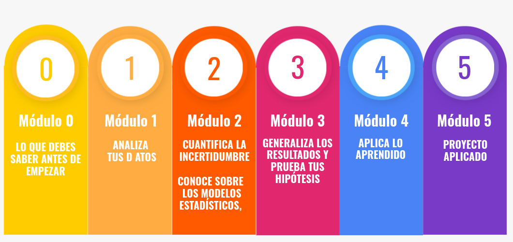
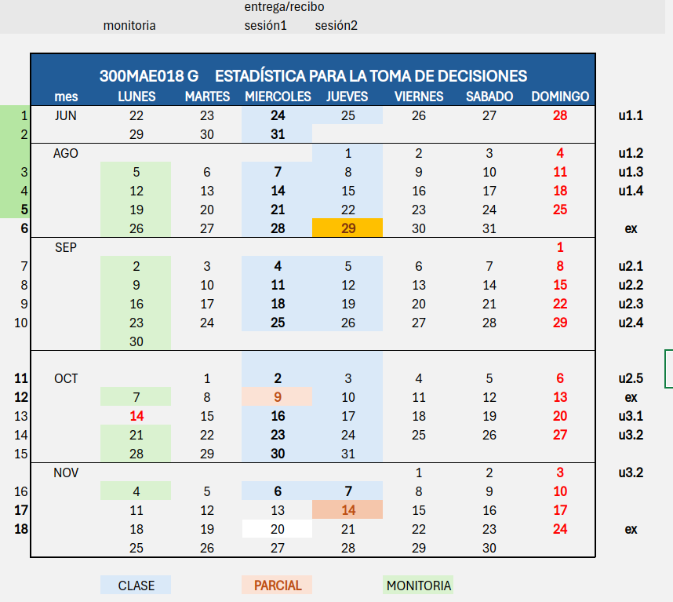
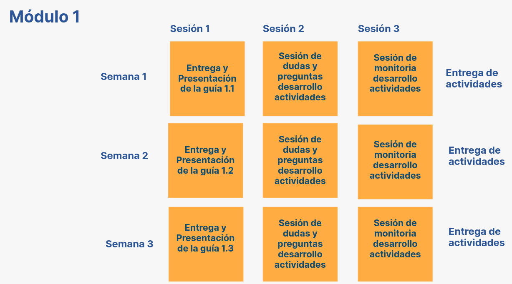

```{r setup, include=FALSE}
knitr::opts_chunk$set(echo = TRUE, comment = NA)
```

# <span style="color:#2C5697">**Estadística para la toma de decisiones - G**</span>


```{r, echo=FALSE, out.width="70%", fig.align = "center"}
 
```


<br/><br/><br/>

## **Cronograma**

<div class="highlight-box">

```{r, echo=FALSE, out.width="70%", fig.align = "center"}

```

</div>


<br/><br/>

## **Salones de clase**

<div class="box2">


|Curso     | **Grupo** | Horario       | **LUNES**  |                | **MIERCOLES** |                | **JUEVES**  |
|:---------|:----------|:--------------|:-----------|:---------------|:--------------|:---------------|:------------|
|          |           |               |            |                |               |                |             |
|30MAE018  |    G      |11:00 a 13:00  | **PL 4.7** |                |  **LG 1.0**   |                | **AL 1.2**  |
|          |           |               |  Monitoría |                |  Sesión 1     |                | Sesión 2    |


```{r, echo=FALSE, out.width="100%", fig.align = "center"}
 # knitr::include_graphics("img/salones.png")
```

</div>


<br/><br/>

## **Metodología**

<div class="box2">


```{r, echo=FALSE, out.width="70%", fig.align = "center"}

```
</div>

## **Salones de clase**

<div class="box2">


|Curso     | **Grupo** | Horario       | **LUNES**  |                | **MIERCOLES** |                | **VIERNES** |
|:---------|:----------|:--------------|:-----------|:---------------|:--------------|:---------------|:------------|
|          |           |               |            |                |               |                |             |
|30MAE018  |    A      |11:00 a 13:00  | **PL 4.7** |                |  **LG 1.0 **  |                | **AL 2.2**  |
|          |           |               | Monitoría  |                |  Sesión 1     |                | Sesión 2    |


```{r, echo=FALSE, out.width="100%", fig.align = "center"}
 # knitr::include_graphics("img/salones.png")
```


</div>

<br/>


<div class="box2">

#### **Profesor** : Daniel Enrique González

* correo : dgonzalez@javerianacali.edu.co
* oficina : 1.28 Edificio de Ingeniería

#### **Monitor** : José Cepeda

</div>

<br/>

### **Horarios de atención**

<div class="box2">

```{r, echo=FALSE, out.width="70%", fig.align = "center"}
 
```

</div>


<br/><br/><br/>

## **Información supletorios**
<div class="box2">

### **DPTO. DE CIENCIAS NATURALES Y MATEMÁTICAS**
#### **EXÁMENES SUPLETORIOS - 1er corte**

**DIURNOS**

- **Fecha:** Lunes 9 de septiembre de 2024
- **Hora:** 4:00 P.m. a 6:00 P.m.
- **Lugar:** Edificio Lago, salón 2.4 (Fac. Ing.) - salón 2.7 (demás Facultades)

**NOCTURNOS (solo carreras nocturnas)**

- **Fecha:** Lunes 9 de septiembre de 2024
- **Hora:** 6:30 p.m. a 8:30 p.m.
- **Lugar:** Edificio Lago, Salón 2.7


```{r, echo=FALSE, out.width="70%", fig.align = "center"}
 # knitr::include_graphics("img/supletorio1.png")
```

</div>


<br/><br/><br/>

## **Información básica**

<div class="box2">

<br/>

* Código : 30MAE018
* Departamento que la ofrece : Ciencias Naturales y  Matemáticas
* Área de conocimiento. Estadística -Matemáticas y Ciencias Naturales  
* Nucleo básico de conocimiento : Estadística
* Créditos : 3
* Número total de horas : 144
* Horas de clase semanales : 4
* Horas de trabajo independiente : 5 (2 con monitor, 3 estudiante solo)

* Prerrequisitos : Teoría de Probabilidad (300MAE013)
* Correquisitos : ninguno
* Asignaturas equivalentes : ninguna
* Modalidad : Presencial
* Idioma en que se imparte : Español

</div>

<br/>

## **Descripción de la asignatura**

<div class="box2">

Existe un llamado frecuente de múltiples estamentos nacionales e internacionales hacia la consolidación de bases de datos que permitan el análisis de indicadores cuantitativos que evidencien el estado, las tendencias y la proyección de los aspectos prioritarios en el desarrollo de las regiones. 

La constante en todos estos casos, es el apoyo que han brindado los métodos estadísticos en la valoración, análisis y seguimiento de los indicadores de desarrollo desde cada panorama para los nuevos desarrollos y la prosperidad de muchas regiones e instituciones. 

En el curso Estadística para la toma de decisiones se propone aportar a los estudiantes las herramientas teóricas y prácticas del análisis cuantitativo de datos con el fin de fortalecer habilidades y destrezas en la recolección, procesamiento, interpretación y comunicación de resultados ligados al análisis de datos en situaciones del diario vivir o del desarrollo profesional en el campo de las ciencias económicas y administrativas. 
</div>

<br/>


## **Intencionalidades formativas**
<div class="box2">


| Competencias                    | Indicadores                 |
|:--------------------------------|:----------------------------|
|**Comunicativa**: Leer, interpretar y expresar, conceptos básicos de la estadística en situaciones y contextos diversos. | **Com**: Transmite con leguaje estadístico las ideas, análisis e interpretaciones situaciones planteadas.|
|**Resolución de problemas**: Conocer, aplicar y calcular técnicas estadísticas, indicadores y probabilidades en situaciones y contextos diversos| **Res1**. Identifica y aplica indicadores, técnicas estadísticas de procesamiento de datos y modelos probabilísticos necesarios para comprender el problema de interés.  |
||**Res2**. Comprende la información estadística disponible en tablas, bases de datos, resultados de procesamientos, publicaciones, indicadores descriptivos y probabilísticos.|
||**Res3**. Resuelve el problema usando indicadores,  técnicas estadísticas de procesamiento de datos y modelos probabilísticos.|
|**Computacional**: Aplicar métodos estadísticos a través del lenguaje de programación R y herramientas de visualización para la solución de problemas que faciliten el aprendizaje de conceptos a través de simulaciones en el contexto de estadística y probabilidad para alcanzar las soluciones propuestas. Esta competencia se centra en el uso de R y herramientas de visualización para abordar problemas estadísticos, permitiendo a los estudiantes no solo aprender conceptos teóricos, sino también aplicar estos conocimientos en situaciones prácticas mediante simulaciones y análisis de datos. | **Com**. Aplicar métodos estadísticos a través del lenguaje de programación R y herramientas de visualización para la solución a problemas que faciliten el aprendizaje de conceptos a través de simulaciones en el contexto de estadística y probabilidad para alcanzar de las soluciones propuestas.|
|||

</div>

<br/>

## **Objetivos**

<div class="box2">

#### **Objetivos de la asignatura**    

<br/>

* Comprender conceptos estadísticos para aplicarlos en situaciones de interés, mediante las lecturas, talleres, interacción en clase y la búsqueda bibliográfica.

* Procesar información estadística para analizar una situación de interés en un contexto determinado, mediante la elaboración de talleres, laboratorios, interacción en clase y un proyecto aplicado.

* Interpretar información estadística proveniente de diferentes fuentes, para el análisis y soporte en la toma de decisiones, mediante lecturas, talleres, laboratorios y trabajos en grupo.

* Comunicar con lenguaje estadístico, las interpretaciones y exposiciones de sus análisis alrededor de diferentes situaciones de interés, mediante la interacción en clase, informes escritos y presentaciones orales.

<br/><br/>

Las siguientes son las competencias que priorizan el seguimiento al aprendizaje de los estudiantes: 

<br/>


#### **Objetivos Instruccionales**:

<br/>

* Reconoce los elementos primordiales de la metodología estadística.

* Se apoya de medios tecnológicos y software para procesar datos estadísticos.

* Interpreta en contextos específicos los indicadores de centramiento, dispersión, posición y correlación más frecuentes. 

* Identifica las condiciones de un experimento y define en él variables aleatorias y sus propiedades para usarlas en el cálculo de probabilidades de eventos asociados.

* Diferenciar un estimador de un parámetro y lo usa al abordar una inferencia. 

* Comprende y usa la estimación, el procedimiento de hipótesis estadística y la estimación por mínimos cuadrados en el modelo de regresión lineal en situaciones de interés.

* Interpretar los resultados en la estimación de la media y la proporción en situaciones con una población involucrada.
</div>

<br/>


## **Contenidos de la asignatura** 

<div class="box2">

#### **Módulo 1:** Estadística descriptiva 

* Conceptos básicos. Pasos de la metodología estadística, diferencia un estudio descriptivo de uno inferencial. 
* Análisis univariado: Resumen de información estadística a través de tablas, gráficos de frecuencia, indicadores de tendencia central, dispersión y posición.
* Análisis bivariado: Análisis de información cruzada, frecuencias marginales, conjuntas y condicionales.  Análisis de la relación lineal entre variables cuantitativas. Gráficos de dispersión. Coeficiente de correlación lineal


#### **Módulo 2:** Probabilidad y Variable aleatoria

* Axiomas de probabilidad
* Probabilidad de eventos, combinación y permutación. Probabilidad condicional, de la unión y de la intersección de eventos. Independencia de eventos. 
* Estrategias de análisis: tabla de probabilidad, diagrama de árbol, diagrama de Venn
* Función de probabilidad para una variable aleatoria. 
* Esperanza matemática y varianza de una variable aleatoria 
* Función bivariada. Independencia entre variables aleatorias. 
* Valor esperado, varianza y desviación estándar de la combinación lineal de variables aleatorias independientes.
* Modelos discretos: Bernoulli, Binomial y Poisson
* Distribución Normal

 
#### **Módulo 3:**  Nociones de Inferencia Estadística 

* Introducción al muestreo, Muestreo probabilístico: aleatorio simple, estratificado, por conglomerado, sistemático.  Muestreo no probabilístico. 	
* Estimación Puntual, Teorema del límite central. Distribución de muestreo de los estadísticos , 
* Distribución de muestreo Chi cuadrada, T de Student  y F.
* Hipótesis estadística: Elementos y tipo de errores posibles en una prueba de hipótesis estadística. 
* Procedimientos de Prueba de Hipótesis para la media y para la proporción en una población y dos poblaciones.


#### **Módulo 4:** Regresión Lineal

* Introducción Modelo de Regresión Lineal 
* Estimación del Modelo de Regresión Lineal Simple
* Análisis del modelo: coeficiente de correlación lineal, validación de supuestos. Prueba F para la bondad de ajuste. 

</div>

<br/>

## **Estrategias pedagógicas** 

<div class="box2">


<br/>

* El curso se desarrolla en modalidad presencial, con dos encuentros los dias miercoles y viernes y un encuentro con el acompañamiento de un monitor los dias lunes, que guiará el desarrollo de un taller diseñado para fortalecer la comprensión y habilidad resolutiva de los estudiantes.

* Cada semana se presentará una unidad que será trabajada durantes las sesiones con talleres, simulaciones, laboratorios computacionales, lecturas y ejercicios análisis de situaciones y aplicaciones directas en el contexto de las ciencias económicas y administrativas.

* También se contemplan espacios para el acompañamiento fuera de clase y bajo la tutoría de diferentes profesores 

* La plataforma Bs será el principal canal de comunicación para el desarrollo del curso.

* Se planea un proyecto de aplicación para desarrollar en por fases donde los estudiantes enfrentan situaciones críticas con la teoría o los métodos estadísticos.
</div>

<br/>

## **Evaluación** 

<div class="box2">


<br/>

|Actividades porcentajes | Número de actividades | porcentaje por actividad | Porcentaje Total por actividad | 
|:-----------------------|:---------------------:|:------------------------:|:------------------------------:|
| Exámenes               | 3                     |  20                      | 60                             |
| Actividades            | 5                     |   4                      | 20                             | 
| Trabajo aplicado       | 1                     |  20                      | 20                             | 

</div>
<br/>


## **Referencias bibliográficas** 

<div class="box2">


* Anderson, D. Sweeney, D. Williams, T. (2016) Estadística para administración y economía. Décima segunda edición. México, Internacional Thomson Editores. Biblioteca General Colección Abierta Semisótano 519.5 E792e
* Levine, D. Krehbiel, T. Berenson, M. (2014) Estadística para Administración.   Sexta 
edición.   Editorial Pearson
* Lind D, Marchal, W.  Wathen S. (2008). Estadística aplicada a los negocios y a la economía. Decimotercera edición. Mc Graw Hill
* Newbold, P.  Carlson, W. y Thorne, B. (2013). Estadística para administración y economía. Sexta edición. Pearson Prentice Hall.
* Webster, A. (2000) Estadística aplicada a los negocios y a la economía. Tercera edición. Mc Graw Hill

* Recursos de Apoyo
</div>


<br/><br/><br/>

 
 
