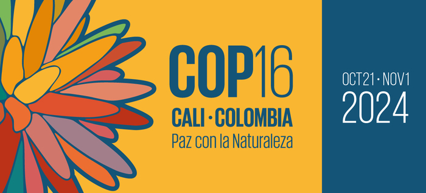

---
title: <span style="color:#235784"> </span>  
subtitle: <span style="color:#235784">**Probabilidad y Estadística**</span> 
author: "dgonzalez "
output:
  html_document:
    toc: no
    toc_depth: 2
    toc_float: yes
    code_folding: hide
    theme: flatly
---    


```{r setup, include=FALSE}
options(htmltools.dir.version = FALSE)
knitr::opts_chunk$set(
  fig.width=9, fig.height=3.5, fig.retina=3,
  out.width = "100%",
  cache = FALSE,
  echo = TRUE,
  message = FALSE, 
  warning = FALSE,
  hiline = TRUE
)
# colores
c0= "#FFCC00"
c1= "#FFAD42"
c2= "#FF5A42"
c3= "#E1286F"
c4= "#4983F6"
c5= "#783AC7"
c6= "#2C5697" # AZZUL INSTITUCIONAL
c7= "#F7F7F7" # FONDO GRIS CLARO WEB

paleta4=c(c0,c1,c2,c3)


library(forcats)
library(patchwork)
library(lubridate)
library(ggplot2)
library(gridExtra)
library(cowplot)
library(summarytools)

#library(dviz.supp)
```


</br></br></br>


# **Guía**


```{r, echo=FALSE, out.width="100%", fig.align = "left"}

```
Tonado de : https://www.cali.gov.co

</br></br>

### **1. Introducción**

</br>

La XVI Conferencia de las Naciones Unidas sobre el Cambio Climático de 2024 , conocida como **COP16** , se llevará a cabo en la ciudad de Cali, Colombia,   evento clave en las negociaciones globales para combatir el cambio climático. Durante esta conferencia, los países participantes realizarán acuerdos y compromisos para reducir las emisiones de gases de efecto invernadero, establecer mecanismos de financiamiento para los países en desarrollo y formular políticas de adaptación a los efectos del cambio climático. A ella acudirán representantes de los paises que firmaron el Convenio sobre Diversidad Biológica (CDB) adoptado durante la Cumbre de la Tierra en Rio de Janeiro en 1992.

</br>

El proyecto a desarrollar en el curso de Probabilidad y Estadística, tiene como objetivo que los estudiantes analicen datos relacionados con las temáticas discutidas en la COP16, como la evolución de las emisiones de carbono, la adopción de energías renovables, la financiación para proyectos de mitigación, entre otros. Los estudiantes deberán aplicar técnicas de estadística descriptiva y estadística inferencial para analizar estos datos, interpretarlos y comunicar sus hallazgos a través de un **póster científico** .

</br>

Cada equipo, conformado por hasta 4 estudiantes , seleccionará un tema específico vinculado a la **COP 16** y desarrollará un análisis basado en datos reales provenientes de fuentes abiertas. El proyecto  permitirá a los estudiantes practicar el uso de herramientas estadísticas, desarrollar habilidades de análisis de datos y aprender a presentar resultados de manera clara y efectiva.

</br></br>

### **2. Objetivos del proyecto**

* Aplicar herramientas de estadística descriptiva e inferencia estadística sobre datos relacionados con las temáticas discutidas en la COP 16.
* Desarrollar habilidades de trabajo en equipo y colaboración para llevar a cabo un análisis estadístico completo.
* Crear un póster científico que resuma los resultados del análisis de manera clara, precisa y con enfoque académico.

</br></br>

### **3. Entregas del proyecto**

</br>

#### **Primera Entrega (Parcial 1)**: 

* Título, Introducción, Problema, Objetivo y Fuentes de Información
* Fecha de Entrega  : **septiembre 26**.

* Contenido :
  * Título del Proyecto : El equipo debe definir un título claro y conciso.
  * Introducción : Explicación del contexto y la relevancia del tema seleccionado en relación con la COP 16.
  * Problema : Definir el problema de investigación o la pregunta principal a resolver mediante el estadístico (ej. “¿Qué impacto han tenido las políticas de la COP 16 en la reducción de emisiones de CO2 en países en desarrollo?”).
  * Objetivo : Establecer el objetivo principal del análisis (ej. “Analizar la evolución de las emisiones de CO2 en países de América Latina después de la COP 16”).
  * Fuentes de Información : Identificar y listar las fuentes de datos abiertas que se utilizarán para el análisis.

</br>

#### **Segunda Entrega (Parcial 2)**: 

* Análisis Descriptivo
* Fecha de Entrega Sugerida : **octubre 10**.
* Contenido :
  * Análisis Descriptivo : El equipo debe presentar un análisis descriptivo de los datos recolectados. Esto incluye:
  * Medidas de tendencia central (media, mediana, moda).
  * Medidas de dispersión (desviación estándar, varianza).
  * Visualización de datos a través de gráficos (histogramas, diagramas de caja, gráficos de barras).
  * Interpretación preliminar : Presentar las primeras conclusiones o tendencias observadas.

</br>

#### **Tercera Entrega (Entrega Final)**: 

* Póster Científico
* Fecha de Entrega Sugerida : **noviembre 7**.
* Contenido del Póster: El equipo debe diseñar y entregar un póster científico que resuma el proyecto completo. El póster debe incluir:
  * Título : Nombre del proyecto.
  * Nombre de los integrantes con su respectiva afiliación.
  * Introducción : Breve descripción del contexto del problema.
  * Análisis Descriptivo : Resultados y gráficos del análisis descriptivo.
  * Análisis Inferencial : Presentación de pruebas estadísticas y su interpretación (ej. pruebas de hipótesis, regresión).
  * Conclusiones : Reflexión sobre los resultados obtenidos.
  * Referencias bibliográficas
  
  </br>

<div class="box3 with-label">
<div class="label">Nota:</div>

* El póster es un producto académico , no una infografía comercial. Se deben priorizar los datos y el análisis, asegurando que el contenido sea claro y con rigor científico. Debe incluir por lo menos seis inferencias estadisticas - intervalos de confianza y/o pruebas de hipótesis.

* Podrá encontrar plantillas en formato latex en [Overleaf](https://es.overleaf.com/gallery/tagged/poster). No se aceptan trabajos realizados en Canvan o PowerPoint

*  Otra alternativa es el paquete de R : `posterdown`, el cual genera una plantilla.  

</div>
</br></br>

<!-- ### Ejemplos de temas por área -->
<!-- Biología : -->

<!-- "Impacto del cambio climático en la biodiversidad de los ecosistemas marinos tras la COP 16". -->
<!-- "Relación entre el aumento de temperaturas y la migración de especies en peligro de extinción". -->
<!-- Ingenierías : -->

<!-- "Evaluación de la eficiencia energética en sectores industriales post-COP 16". -->
<!-- "Análisis del desarrollo de tecnologías de energía solar tras la implementación de las políticas de la COP 16". -->
<!-- Administración : -->

<!-- "Estrategias empresariales para cumplir con los compromisos de sostenibilidad post-COP 16". -->
<!-- "Impacto de las políticas ambientales en la gestión de recursos humanos en empresas multinacionales". -->
<!-- Finanzas : -->

<!-- "Evaluación del financiamiento de proyectos de mitigación climática post-COP 16". -->
<!-- "Análisis del rendimiento de los bonos verdes tras los acuerdos de la COP 16". -->
<!-- Economía : -->

<!-- "Impacto económico de las políticas de reducción de emisiones en los países de América Latina tras la COP 16". -->
<!-- "Relación entre el crecimiento económico y la sostenibilidad ambiental post-COP 16". -->
<!-- Criterios de evaluación -->
<!-- Primera Entrega (15%): Claridad en la formulación del título, introducción, problema y objetivo. -->
<!-- Segunda Entrega (25%): Correcto uso de herramientas de estadística descriptiva y coherencia en la interpretación de los datos. -->
<!-- Tercera Entrega (Póster Científico) (60%): Calidad del análisis inferencial, claridad en el póster, y capacidad para comunicar los resultados de manera efectiva. -->