---
title: <span style="color:#235784"> </span>  
subtitle: <span style="color:#235784">**Módulo 3**</span> 
author: "dgonzalez "
output:
  html_document:
    toc: no
    toc_depth: 2
    toc_float: yes
    code_folding: hide
    theme: flatly
    css: style.css
---      

```{r setup, include=FALSE}
knitr::opts_chunk$set(echo = TRUE, message = FALSE, warning = FALSE, comment = NA)
library(psych)
library(summarytools)

# install.packages("devtools")
#devtools::install_github("dgonxalex80/paquete018")
#library(paquete018)


# colores
c0= "#FFCC00"
c1= "#FFAD42"
c2= "#FF5A42"
c3= "#E1286F"
c4= "#4983F6"
c5= "#783AC7"
c6= "#2C5697" # AZZUL INSTITUCIONAL
c7= "#F7F7F7" # FONDO GRIS CLARO WEB

```


```{r, echo=FALSE, out.width="100%", fig.align = "center"}
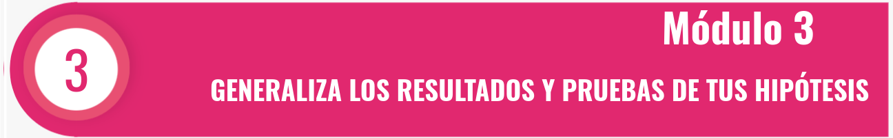
```


<br/><br/>

## **Prueba z para media con varianza conocida**

```{r, echo=FALSE, out.width="100%", fig.align = "center"}
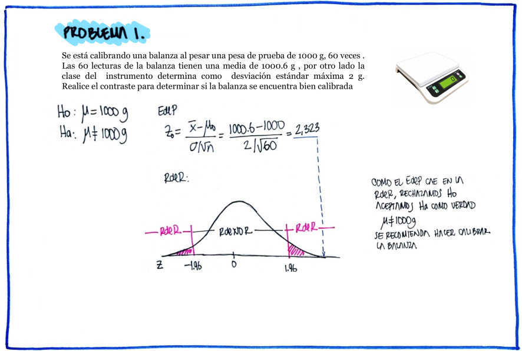
```
<audio controls>
  <source src="audio/problema1.mp4" type="audio/mpeg">
  Tu navegador no soporta el elemento de audio.
</audio>


<br/><br/><br/>


```{r, echo=FALSE, out.width="100%", fig.align = "center"}
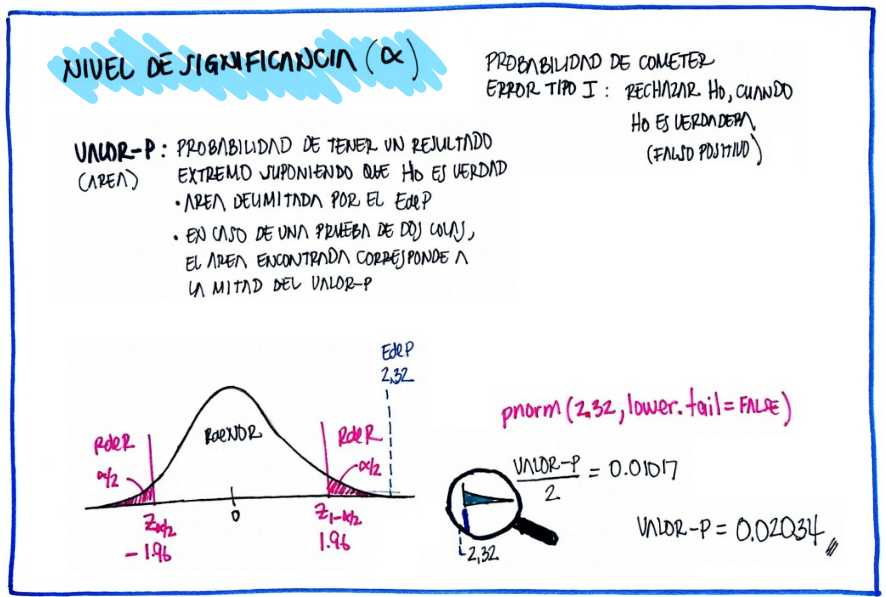
```
<audio controls>
  <source src="audio/problema1a.mp4" type="audio/mpeg">
  Tu navegador no soporta el elemento de audio.
</audio>


<br/><br/><br/>

```{r, echo=FALSE, out.width="100%", fig.align = "center"}
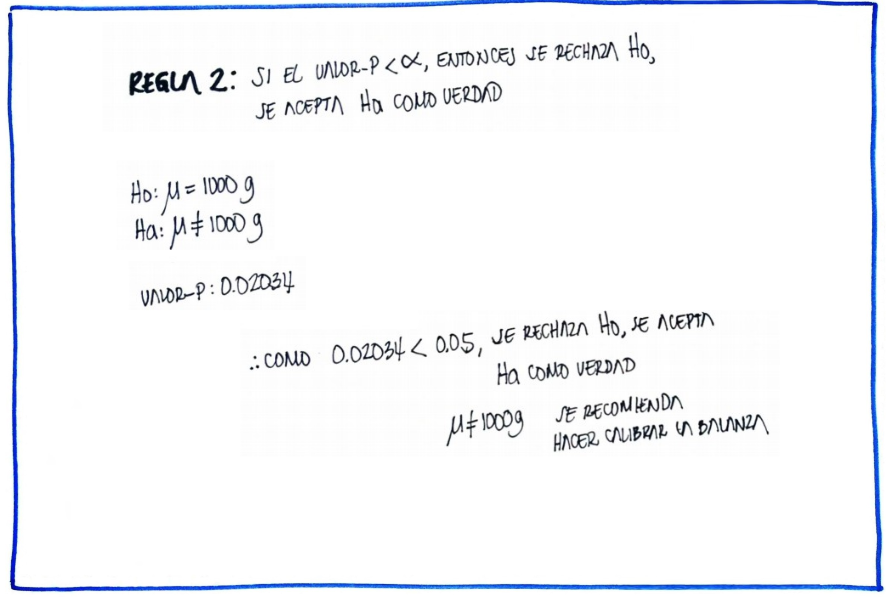
```

<br/><br/><br/>

## **Prueba t para una media con varianza desconocida**

```{r, echo=FALSE, out.width="100%", fig.align = "center"}
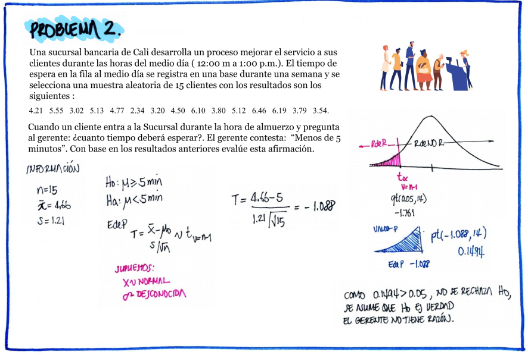
```

<br/><br/><br/>


## **Prueba z para una proporción**

```{r, echo=FALSE, out.width="100%", fig.align = "center"}
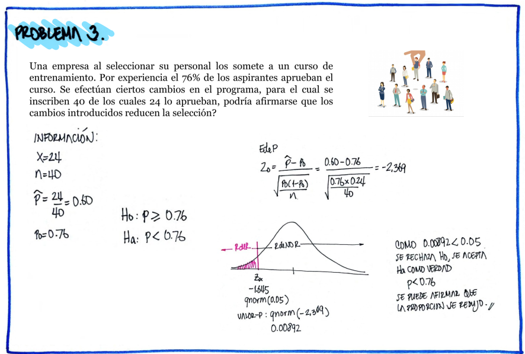
```


<br/><br/><br/>


## **Prueba t para comparación de medias, grupos independientes**

```{r, echo=FALSE, out.width="100%", fig.align = "center"}
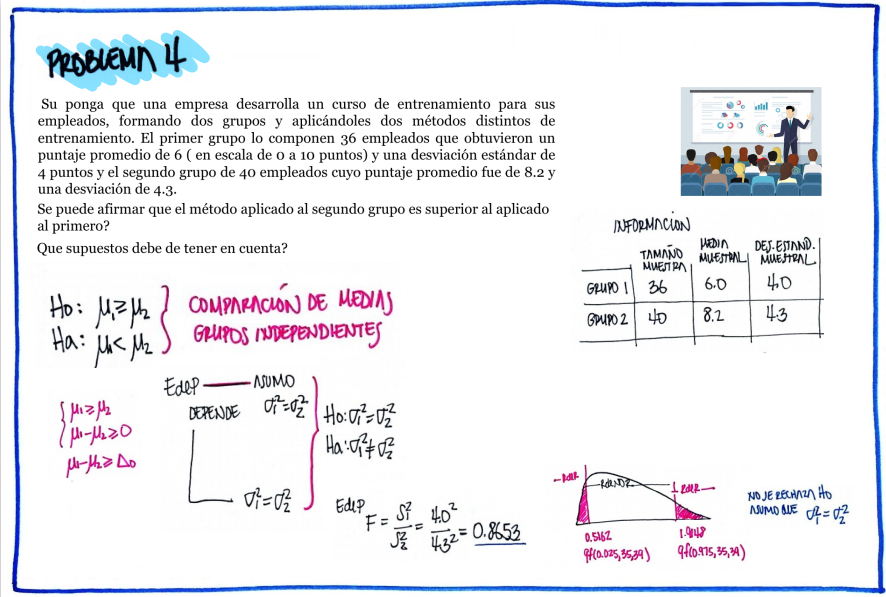
```

<br/><br/><br/>

```{r, echo=FALSE, out.width="100%", fig.align = "center"}
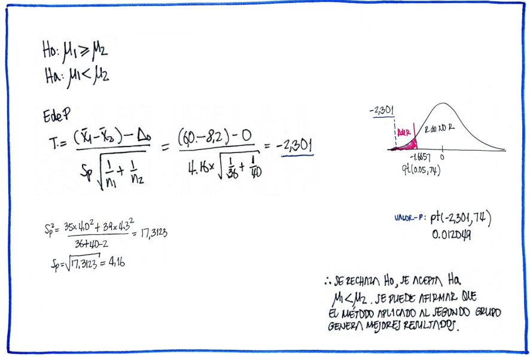
```


<br/><br/><br/>

## **Prueba z para una proporción**

```{r, echo=FALSE, out.width="100%", fig.align = "center"}
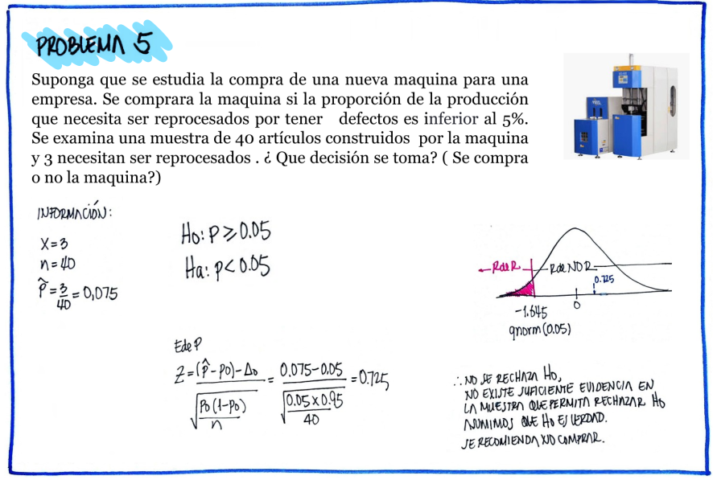
```

<br/><br/><br/>

## **Prueba t para comparación de grupos independientes**

```{r, echo=FALSE, out.width="100%", fig.align = "center"}
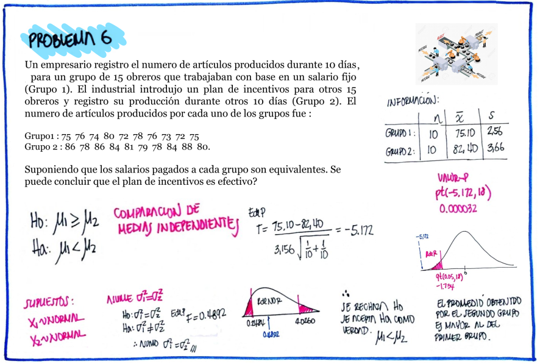
```


<br/><br/><br/>

## **Prueba z para comparación de proporciones**

```{r, echo=FALSE, out.width="100%", fig.align = "center"}
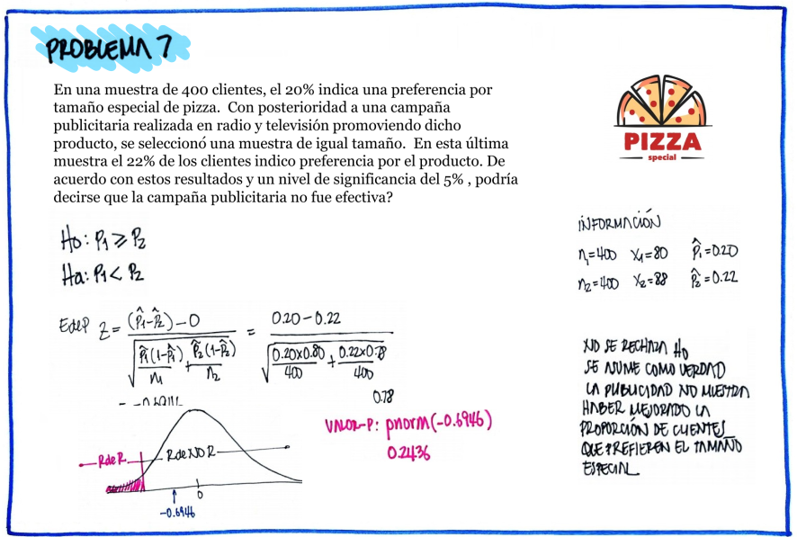
```


<br/><br/><br/>

## **Prueba t para grupos pareados**

```{r, echo=FALSE, out.width="100%", fig.align = "center"}
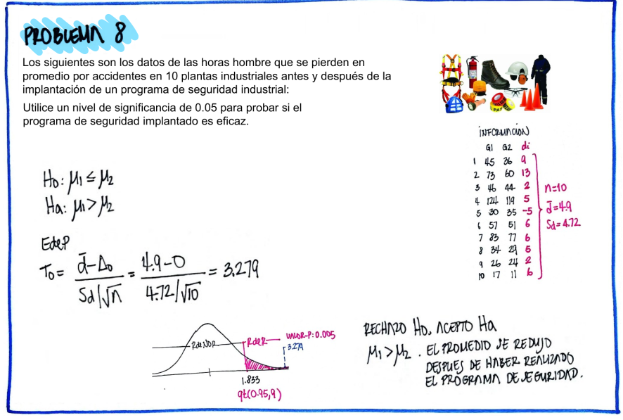
```


<br/><br/><br/>

## **Prueba t para grupos pareados**

```{r, echo=FALSE, out.width="100%", fig.align = "center"}
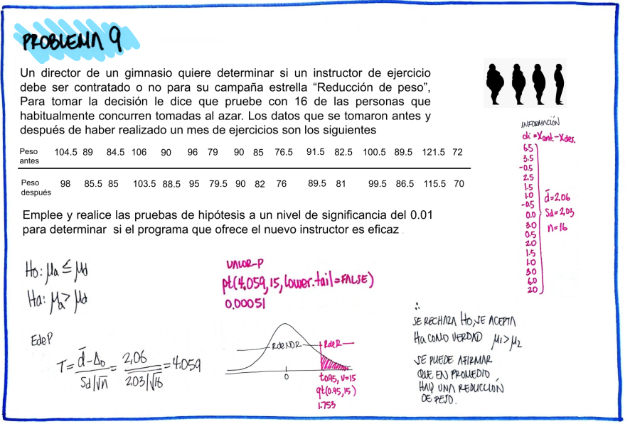
```

<br/><br/><br/>

## **Prueba t para grupos independientes con varianzas iguales**

```{r, echo=FALSE, out.width="100%", fig.align = "center"}
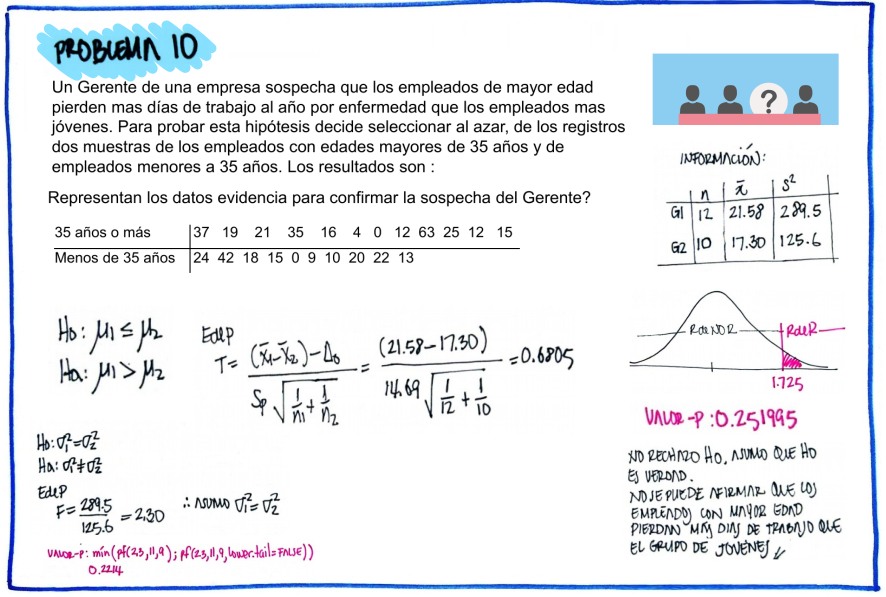
```

<br/><br/><br/>


## **Prueba chi-cuadrado de bondad de ajuste**

```{r, echo=FALSE, out.width="100%", fig.align = "center"}
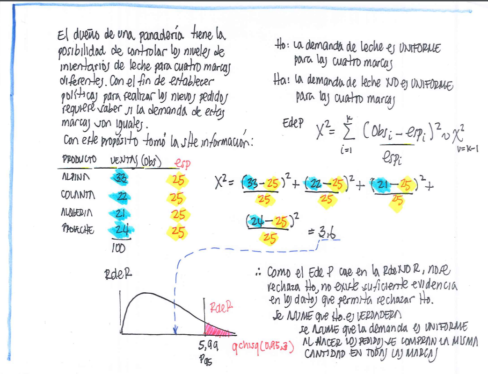
```


<br/><br/><br/>

## **Prueba chi-cuadrado para tablas de contingencia**

```{r, echo=FALSE, out.width="100%", fig.align = "center"}
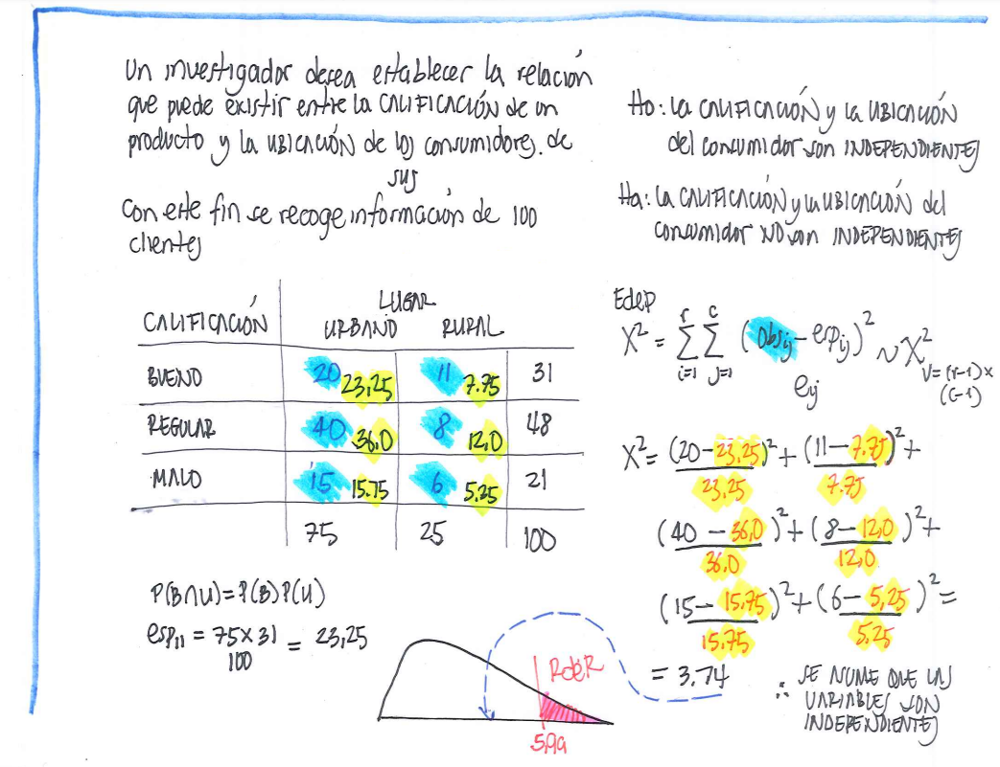
```


