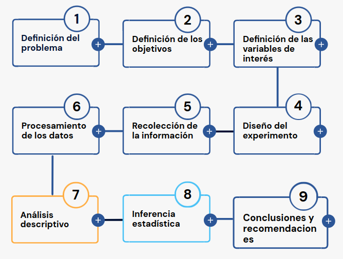

---
title: <span style="color:#235784"> </span>  
subtitle: <span style="color:#235784">**Unidad 1.1**</span> 
author: "dgonzalez "
output:
  html_document:
    toc: no
    toc_depth: 2
    toc_float: yes
    code_folding: hide
    theme: flatly
---    


```{r setup, include=FALSE}
knitr::opts_chunk$set(comment = NA)

library(RColorBrewer)
library(summarytools)
library(knitr)
library(readxl)
library(tidyverse)
#install.packages('remotes')  # solo una vez
library(remotes) # solo una vez
data(Colombia23)
library(readxl)

# colores
c0= "#FFCC00"
c1= "#FFAD42"
c2= "#FF5A42"
c3= "#E1286F"
c4= "#4983F6"
c5= "#783AC7"
c6= "#2C5697" # AZZUL INSTITUCIONAL
c7= "#F7F7F7" # FONDO GRIS CLARO WEB
knitr::opts_chunk$set(echo = TRUE, message = FALSE, warning = FALSE, comment = NA)
library(psych)
library(summarytools)

# install.packages("devtools")
#devtools::install_github("dgonxalex80/paquete018")
#library(paquete018)


```

<br/><br/>


Con el fin de tener una idea inicial del propósito de este módulo, se presenta información relacionada con los estudiantes que toman el curso utilizando para ello gráficos e indicadores estadísticos, los cuales podremos interpretar al finalizar el módulo.

<br/><br/>


#  <span style="color:#235784"> **Metodología Estadística**</span>

<br/><br/>

Una forma de abordar el curso de Probabilidad y Estadística e mediante la metodolgía estadística, que al igual que el método cientifico está conformada por una serie de etapas que van desde la definición del problema hasta la escritura del informe final con las conclusiones y recomendaciones.

<br/>


```{r, echo=FALSE, out.width="70%", fig.align = "left"}

```

<br/><br/>


La descripción de cada una de ellas se presenta a continuación: 

<br/><br/><br/>

## **1. Planteamiento del problema**

El planteamiento del problema puede tener varios orígenes, entre los cuales podemos mencionar: 

+ Inquietud personal por resolver un problema
+ Lluvia de ideas de un grupo de personas
+ Solicitud realizada por entidad regional, empresa o persona
 
Se recomienda en este caso iniciar con una revisión bibliográfica que permitan a los interesados buscar grupos de personas que enfrentan problemas similares, que tipo de soluciones ha propuesto o están implementando.  Es posible que el problema al que nos enfrentamos ya tenga una buena solución y por tanto no tendría sentido destinar una serie de recursos para estudiar lo que ya otros tienen solucionado. 

En caso de tratarse de un problema con cierta frecuencia pero con características muy particulares, es necesario además de la revisión bibliográfica determinar:

+ Antecedente
+ Preguntas de investigación
+ Hipótesis de investigación / Preguntas de investigación
+ Justificación del estudio
+ Delimitación del problema

<br/><br/>

<div class="box1 with-label">
<div class="label">Ejemplo 1</div>

+ Aumento de embarazo de adolescentes en Colombia
+ Incremento de fugas de energía eléctrica en la ciudad
+ Incremento de la tasa de empleo informal
+ Incremento de incapacidades  causadas por accidentes automovilísticos
+ Aumento del tiempo de atención al cliente
+ Aumento de quejas por prestación de servicios
+ Aumentó corrupción en Colombia, según Transparencia Internacional 
+ Disminución de la demanda de educación superior

</div>
<br/><br/><br/>

## **2. Definición de los objetivos** 

Al iniciar una investigación uno de los primeros pasos debe ser el definir de la forma más  clara  el  propósito u objetivo principal del estudio. Estos deben de estar orientados a la solución del problema  
Los objetivos pueden ser:

+ Generales: definen  a  grandes  rasgos  el  propósito  del trabajo de  investigación.
+ Específicos: definen  en  detalle  los  fines  de  la  investigación. Cuanto  más  detallado  sean  los  objetivos específicos más fácil será planear  las  etapas  para  lograrlos.

Algunos verbos utilizados para la especificación de los objetivos son: definir, describir,  implementar,  nombrar,  expresar, interpretar, explicar,  estimar,  retomar,  formular,  combinar,  resolver,  producir,   preparar,  demostrar, determinar ... 

Algunos verbos que se recomienda no utilizar: saber, aprender, conocer, entender,  apreciar..

<br/><br/>

<div class="box1 with-label">
<div class="label">Ejemplo 2</div>

+ Establecer los principales causas de las fugas de energía eléctrica en la  ciudad 
+ Determinar  las  principales causas de las incapacidades del personal por causas extralaborales
+ Determinar los principales factores que inciden sobre el aumento del tiempo de atención 
+ Establecer cuáles son los principales factores que inciden en la escogencia de la carrera universitaria

</div>

<br/><br/><br/>

## **3. Definición de las variables de interés** 

Después del planteamiento del problema y determinación de los objetivos de la investigación se realiza un examen sobre la información que se requiere para el cumpliendo de los objetivos ya sea a través del cumplimiento de indicadores o del examen de los niveles de algunas características importante de la población.

La información requerida se mide a través de variables aleatorias, que corresponde a valores diferentes que poseen cada objeto de la población de interés. A esta característica se le llama variable aleatoria, concepto que se utilizará durante todo el curso

Variables >>>>  Objetivos >>>>>>> Problema

Existen diferentes formas de clasificación de las variables aleatorias, inicialmente nos enfocaremos en la clasificación teniendo en cuenta su naturaleza:

+ Cualitativas ($@$)
+ Cuantitativas ($\#$)

<br/><br/>

### **Variables Cualitativas**  

Corresponden a valores no númericos que pueden corresponder a factores o a niveles de una variable aleatoria

<div class="box1 with-label">
<div class="label">Ejemplo 3</div>

+ Día de la semana, (Lun, Mar, Mié, Jue, Vie, Sáb, Dom) 
+ Estado civil, (soltero, casado, unión libre, separado, viudo)
+ Sexo,(Mujer, Hombre)
+ Satisfacción del cliente por el servicio prestado (Alta, media, baja)
+ Tipo de queja 
+ Barrio donde se produce el daño 
+ Asignatura cursada
+ Carrera o programa académico 

</div>

<br/><br/>

#### **Variables Cuantitativas** 

Son valores numéricos que pueden estar relacionados con la medición, el conteo de eventos o tambien con niveles numéricos que se asignen a variables que se miden a traves de test, pero que corresponden a variables cualitativas. A este último proceso descrito se le llama operacionalización de una variable cualitativa 

<div class="box1 with-label">
<div class="label">Ejemplo 4</div>

+ Consumo de energía en la residencia
+ Tiempo de respuesta a la solicitud
+ Número de servicios realizados en el día
+ Costo del servicio prestado
+ Número de trabajadores que se requieren para solucionar problema
+ Consumo de energía de un hogar en kW-h 
+ Valor de la factura de consumo  de energía para hogares 
+ Valor de la cartera morosa de la empresa en  un  mes determinado 
+ Peso en Kg de una persona 
+ Edad de un estudiante 

</div>

Las variables se miden en diferentes escalas, dependiendo del tipo de valor que pueden tomar. Es necesario tener claro además del tipo de variables,  el tipo de escala, por cuanto esto puede determinar el tipo de procesamiento estadística que se debe utilizar.

<br/><br/>

#### **Escalas de medición**


|tipo de variable | escala            |
|:----------------|:------------------|
| cualitativa     | nominal           |      
| cualitativa     | ordinal           |
| cuantitativa    | de intervalo      |
|cuantitativa     | de razón          |

<br/><br/>

##### **Escala nominal** 

Corresponde a valores no numéricos sin presencia de orden entre ellos. 

Operaciones posibles  al comparar dos valores:

+ podemos afirmas que son iguales
+ podemos afirmar que los valores son diferentes  

<br/><br/>
<div class="box1 with-label">
<div class="label">Ejemplo 5</div>

+ Genero 
+ Estado civil 
+ Nacionalidad 
+ Carrera o programa académico

</div>

<br/><br/>

##### **Escala ordinal** 

Corresponde a valores no numéricos con presencia de orden entre ellos. Es posible realizar las comparaciones de dos valores: 

+ podemos afirmar que los valores son iguales, 
+ podemos afirmar que los valores son diferentes, 
+ podemos afirmar que un valor es menor que el otro valor, 
+ podemos afirmar que un valor es mayor que el otro. 

<br/><br/>

<div class="box1 with-label">
<div class="label">Ejemplo 6</div>

+ Considera que el servicio que acaba de recibir es:
  + $\square$  Excelente,
  + $\square$  Muy bueno,
  + $\square$  Bueno, 
  + $\square$  Regular,
  + $\square$  Muy regular,
  + $\square$  Pésimo     

</div>

<br/><br/>

##### **Escala  de intervalo** 

Corresponde a valores numéricos, dentro de los cuales solo tiene sentido la diferencia entre dos de sus valores. Podemos afirmar al comparar dos resultados : 

+ podemos afirmar que los valores son iguales , 
+ podemos afirmar que los valores son diferentes,  
+ podemos afirmar que un valor es mejor a otro, 
+ podemos afirmar que un valor es mayor que otro,
+ la diferencia (resta) entre dos valores tiene sentido
+ el valor de cero no implica ausencia de la variable

<br/><br/>

<div class="box1 with-label">
<div class="label">Ejemplo 7</div>

+ Temperatura.  La variable se puede medir en diferentes tipos de escalas : 
  + Celsius $^{\circ} C$, (La escala Celsius fue creada  Andrés Celsius (1742) . Esta escala  tiene como referencia los puntos de congelación y ebullición del agua, límites que divide en 100 partes iguales 
  + Kelvin $K$, Creada por William Thompson Kelvin (1848), en la que propone una transformación de la escala Celsius hasta un valor  hipotético en el que hay ausencia de calor. 
  + Fahrenheit $^{\circ}F$  Escala propuesta Gabriel Daniel Fahrenheit (1724), proponiendo una modificación a la escala Celsius

En conclusión la variable temperatura se puede medir en varias escalas 

</div>

En ocasiones variables de tipo cualitativo no observables de manera directa como :

+ Clima laboral
+ Estrés
+ Inteligencia
+ Nivel de desempeño
+ Calidad

Con frecuencia a las variables anteriores se les llama variables latentes debido a que su medición no es directa, sino que se realiza a través de preguntas que se recogen en un instrumento en muchos casos agrupados por factores. Cada respuesta en las preguntas tiene un valor o puntaje que es sumado y determina los niveles de la variable.  Los valores dados  a  las respuestas pueden cambiar de instrumento a instrumento, pues existen escalas con 3 valores, otras con 5, 7 que que pueden representar una escala ordinal. 


A esta transformación numérica (suma de los puntajes obtenidos al totalizar los puntajes obtenidos) se conoce como **operacionalización** a escala de intervalo de una variable cualitativa.  

<br/><br/>

##### **Escala  de razón**

Corresponde a valores  numéricos, para los cuales además de las diferencias también tiene sentido la razón de dos de sus valores.  Al comparar dos resultados de una variable cuantitativa de razón:

+ podemos afirmar que los valores son iguales
+ podemos afirmar que los valores son diferentes
+ podemos afirmar que un valor es mayor que  otro
+ podemos afirmar que un valor es menor que otro
+ la diferencia (resta) entro dos valores tiene sentido
+ la razón o división de dos de sus valores tiene sentido
+ el valor de cero indica ausencia de la variable

<br/><br/>

<div class="box1 with-label">
<div class="label">Ejemplo 8</div>

+ Consumo de energía por hogar en kW-h 
+ Salario que recibe un empleado en pesos colombianos 
+ Utilidad de una empresa obtenida al final del año  
+	Nivel de endeudamiento de una empresa al final del año en porcentaje 
+ Precio del metro cuadrado de tierra  en a comuna 22 de Cali 

</div>

<br/><br/> 

<div class="box3 with-label">
<div class="label">Nota</div>

Es importante poder distinguir entre variables estadísticas y variables no estadística en una base de datos. Para hacerlo nos preguntamos si para la variable en análisis tiene sentido un análisis estadístico (gráficos, tabla o indicadores).  Por ejemplo: No tiene sentido realizar un análisis con variables como :  id, nombre, correo electrónico, dirección, teléfono, longitud y latitud, representante legal, entro otras 

</div>
<br/><br/><br/>

## **4. Diseño del estudio**

Después de tener claro los tres puntos anteriores, es necesario diseñar y prever todas las actividades necesarias para la recolección de la información requerida para el cumplimiento de los objetivos propuestos. Esta parte comprende definir:
		
+ Tipo de estudio
+ Tipo de muestreo (en caso de requerirlo)
+ Tamaño de la muestra

<br/><br/>

#### **Tipo de estudio** 

El tipo de estudio a realizar puede ser:  

+ Experimental
    + Experimento puro
		+ Cuasi-experimento
+ No experimental
    + Transeccional 
      + Exploratorio
      + Descriptivo de uno o más grupos
    + Longitudinal
      + De tendencia
      + De evolución de grupo

<br/><br/>

#### **Algunos conceptos básicos**


**Población**: Conjunto de elementos acerca de los cuales deseamos realizar alguna inferencia.
<br/>

**Censo**: Estudio que incluye todos los elementos de una población. 
<br/><br/>
**Muestra**: Subconjunto de elementos una población, elegidos de un marco muestral. 
<br/><br/>
**Unidad de muestreo** Persona  u  objeto  de  la cual  se toma  la  información. 
<br/><br/>
**Marco muestral**: Listado completo de unidades que conforman una población. Puede obtenerse a través de una lista, mapa, directorio telefónico, base de datos - Cámara de Comercio-, entro otros. 
<br/><br/>
**Muestreo**: Selección de una parte de la población. 
<br/><br/>

Después de determinar el tipo de estudio a realizar es necesario establecer si hacemos censo o muestreo.

Algunas razones para realizar un muestreo en lugar de un censo son:

+ La naturaleza destructiva de ciertas pruebas en algunos casos
+ La imposibilidad física de revisar toda la población
+ El costo - presupuesto limitado
+ Mejor manejo de la información
+ Tiempo necesario para la recolección de la información


En caso de tomar la decisión de realizar un muestreo es necesario determinar: 

+ El tipo de muestreo
+ El tamaño de muestra 
+ La unidad de muestreo
+ El Marco muestral
+ Seleccionar la muestra

<br/><br/>

**Tamaño de la muestra** 

Una de las decisiones importantes en el muestreo, corresponde a determinar el tamaño de la muestra.
		$$n = \dfrac{z_{\alpha/2}^{2} \hspace{.2cm} \sigma^{2}}{e^{2}} $$
		Dónde:

+ $z_{\alpha/2}^{2}$ :Confiabilidad (percentil de la distribución normal estandar
+ $\sigma^{2}$: Varianza de la variable de interés
+ $e^{2}$ : Error de muestreo $|\widehat{\theta}-\theta|<e$


Si $n/N > 0.05$, debemos realizar corrección por población finita.
		$$n = \dfrac{n_{0} \times N}{n_{0}+ N + 1} $$

<br/><br/>

**Tipos de muestreo**

Existen dos tipos de muestreo:

+ Muestreo   probabilística
    + Muestreo aleatorio simple 
    + Muestreo aleatorio estratificado
    + Muestreo aleatorio por conglomerados
		+ Muestreo sistemático
		+ Muestreo compuestos

+ Muestreo   no   probabilística
    + Muestreo por conveniencia
		+ Muestreo por juicio
		+ Muestreo por cuotas
		+  Muestreo bola de nieve

<br/><br/>

#### **Muestreos probabilísticos**
<br/><br/>

**Muestreo Aleatorio Simple**

En este tipo de muestreo se seleccionan los elementos de la población de tal manera que cada elemento tenga igual probabilidad de ser elegido

Para realizarlo se requiere de poseer un marco muestral actualizado y un sistema que permita la escogencia de las unidades de manera aleatoria

<br/>

<div class="box4 with-label">
<div class="label">Código R</div>

|           |                                                                               |
|:----------|:------------------------------------------------------------------------------|
|Excel :    |`=ALEATORIO.ENTRE(1;2000)` permite elegir un número aleatorio entre 1-2000 )   |
|R :        |`sample(1:2000, 50, rep=FALSE)`                                                |

</div>

**Muestreo Aleatorio Estratificado**

Una muestra estratificada se toma separando los elementos de la población en estratos y en cada uno de ellos por separado se toma una muestra aleatoria simple. 

El supuesto que valida este procedimiento se centra en la varianza al interior de los estratos es menor que la varianza que presentan los individuos al total de la población. Esto permite controlar la  varianza de la variable principal, es decir cambiar una población heterogénea por varias homogéneas

<br/><br/>

**Muestreo Aleatorio Sistemático**

En este tipo de muestreo se selecciona la muestra mediante la elección de un punto de inicio de manera aleatoria ($r$) dentro de los $k$ primeros números de la población y la muestra queda determinada por la secuencia: $r$, $r+k$, $r+2k$, $r+3k$, ........ hasta completar el tamaño de la muestra requerida.

Para obtener una muestra aleatoria, establecemos de número aleatorio entre $1$ y $k$ y de esta forma quedan determinados los elementos de la muestra.

<br/><br/>

**Muestreo Aleatorio por Conglomerados**

Cuando la población objeto de estudio se encuentra dividida en subpoblaciones mutuamente excluyentes - llamados conglomerados - y bajo el supuesto de que cada uno de ellos representa la población, el muestreo por conglomerados proporciona una buena alternativa para realizar un muestreo. 

En este caso se debe tener una relación de todos los conglomerados que conforman la población y a partir de este listado se realiza un muestreo aleatorio simple de ellos. Al interior del o los conglomerados seleccionados de esta manera se realiza censo o en otras ocasiones muestreo aleatorio simple. 

<br/><br/>

#### **Muestreos no probabilísticos**

<br/><br/>

**Muestreo por conveniencia**

En este tipo de muestreo la selección de los elementos de la muestra están a criterio del entrevistador, por lo general son seleccionados por estar en el lugar adecuado.

+ Estudiantes
+ Grupos ecológicos
+ Clientes centros comerciales
+ Clientes de un producto determinado
+ Enfermos de VIH

<br/><br/>

**Muestreo por juicio**

Forma de muestreo por conveniencia cuyos elementos se seleccionan de manera intencional con base en el juicio del investigador

+ Testigos expertos que participan en una prueba
+ Estudio de mercado para nuevo producto

<br/><br/>

**Muestreo por cuotas**

Muestreo por juicio restringido a dos etapas: <br/>
Etapa 1: Desarrollo de categorías o cuotas de los elementos de la población (\%) <br/>
Etapa 2: Los elementos se seleccionan de acuerdo a la conveniencia o el juicio del investigador hasta completar el número establecido para cada subgrupo. <br/>

Las características de control pueden ser: sexo, edad, religión, partido político, entre otras, las cuales participan de manera proporcional a lo establecido en la etapa 1. Después de esto el investigador tiene plena libertad para la selección de las unidades en cuanto cumplan con las condiciones de control

<br/><br/>

**Muestreo bola de nieve**

En este método se selecciona inicialmente un grupo de entrevistados. El resto de entrevistados se eligen de acuerdo a información suministrada por los mismos entrevistados -referidos-. Este método permite obtener información rápida y muy fácilmente


<br/><br/><br/>

## **5. Recolección de la información**

Esta etapa comprende el trabajo de campo, la cual implica las siguientes actividades:

+ Construcción o actualización del marco muestral
+ Selección de encuestadores o personas que toman la información
+ Adiestramiento de estas personas  
+ Prueba piloto  (ensayo de los instrumentos de medición)
+ Construcción y  mejoramiento de la  plantilla o instrumento de recolección de los datos
+ Construcción de la base de datos. (Plantilla para captura de datos)
+ Manual de la plantilla o instrumento de recolección de datos
+ Selección de las unidades  que conforman la muestra
+ Selección de las unidades de holgura
+ Coordinación del recibo de la información

<br/><br/><br/>

## **6. Procesamiento de la información**

Esta etapa comprende la construcción de la **base de datos** para que sea procesada posteriormente en un paquete estadístico. Entre los más usados están:

+ SPSS
+ Stata
+ Minitab
+ SAS
+ Statgraphics
+ Eviews
+ **R / Rstudio** 
+ Python

<br/><br/><br/>

## **7. Análisis descriptivo**

El análisis descriptivo es la primera aproximación a la generación de valor agregado de los datos y consiste en  la generación de :

+ cuadros de distribución,  
+ gráficos,  
+ medidas de centro, 
+ medidas de dispersión (variación) y 
+ medidas de forma. 

Este primer análisis lo abordaremos en el **módulo 1** de este curso.

<br/><br/>

## **8. Inferencia estadística**

Esta etapa de la metodología estadística permite generalizar los resultados obtenidos en una muestra a toda la población. Podríamos decir que una de las etapas más importantes. 

La inferencia se puede realizar básicamente de dos maneras:

+ Estimación: Se utiliza cuando se requiere conocer el valor de un parámetro de la población
  + Estimación puntual
  + Estimación por intervalos  de  confianza
 
+ Pruebas  de  hipótesis. Se utiliza cuando se requiere comprobar si una afirmación sobre un parámetro es cierta o falsa.
  + Pruebas de hipótesis paramétricas  
  + Pruebas de hipótesis no  paramétricas 

algunos métodos estadísticos son :

+ **Modelo de regresión lineal**: Estimar mediante una función lineal de las variables independientes, el valor de la variable dependiente. Estimar los efectos producidos por cambios en una variable independiente sobe la variable dependiente (elasticidad)

+ **Análisis discriminante**: Estimar mediante una función lineal de las variables independientes la probabilidad de que cada individuo pertenezca a cada uno de los grupos establecidos por los valores de la variable dependiente

+ **Modelo de regresión logistica, probit**: Estimar mediante una función lineal la probabilidad de que cada individuo pertenezca a uno de los dos grupos establecidos por la variable dependiente
			(0,1) . $Y=F(X\beta)$


+ **Análisis por conglomerados**: Agrupar los elementos de la nuestra en grupos
			homogéneos respecto a las puntuaciones de $k$ variables               

+ **Análisis factorial**: Interpretar las relaciones dentro del conjunto de variables. En el evento de que se determinen subgrupos de variables claramente diferenciadas, el conjunto original puede ser simplificado a un nuevo conjunto no directamente observables llamados factores

+ **Análisis de correspondencia**: Interpretar las similitudes entre  las categorías de una variable respecto a las de otra, así como las relaciones entre las categorías de las otras variables

<br/>
Abordaresmos la estimación y las pruebas de hipótesis en el **módulo 3** y el modelo de regresión lineal en el **módulo 4** de este curso
<br/><br/><br/>

## **9. Conclusiones y recomendaciones**

Por último es la etapa de la redacción del informe final y la construcción de las conclusiones y las recomendaciones.

Se puede afirmar que cuando se cumple un objetivo  se produce una conclusión. 
Cuando no se cumple se produce una recomendación. Ambas tanto conclusiones como recomendaciones son de mucha importancia para la realización de futuras investigaciones.
 


Para abordar las primeras etapas se plantea la **actividad 101**, donde se plantea la necesidad de definir un problema, definir unos objetivos y determinar las variables que serán empleadas para poder cumplir con los objetivos planteados.

<br/>

Continuaremos con una parte importante de esta metodología que está relacionada con la obtención de la información y la construcción de la base de datos.

<br/><br/><br/>
