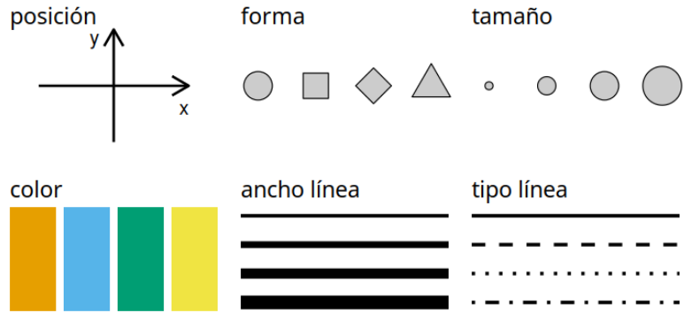
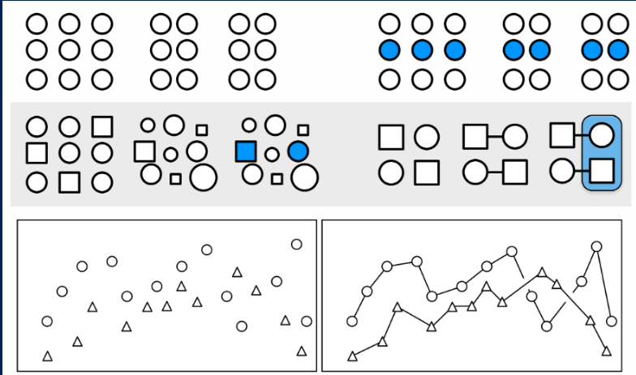
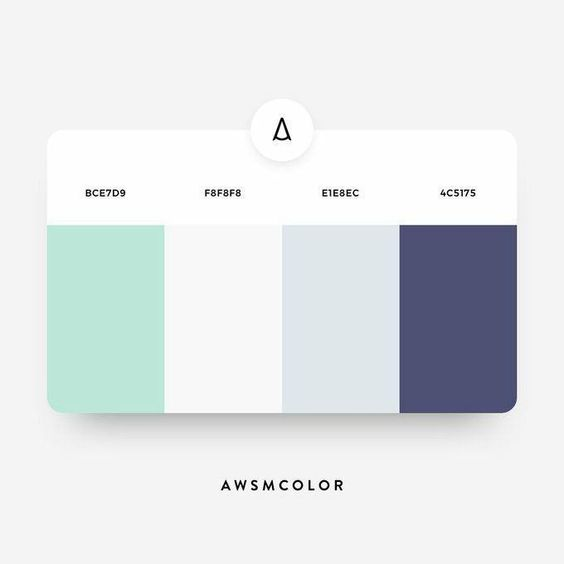

---
title: <span style="color:#235784"> </span>  
subtitle: <span style="color:#235784">**Unidad 1.1**</span> 
author: "dgonzalez "
output:
  html_document:
    toc: no
    toc_depth: 2
    toc_float: yes
    code_folding: hide
    theme: flatly
---    


```{r setup, include=FALSE}
knitr::opts_chunk$set(comment = NA)

library(RColorBrewer)
library(summarytools)
library(knitr)
library(readxl)
library(tidyverse)
# Colombia<- readRDS("data/Colombia.RDS")
pye20222 <- read_excel("data/pye20222.xlsx", sheet = "Sheet4")
# colores
c0= "#FFCC00"
c1= "#FFAD42"
c2= "#FF5A42"
c3= "#E1286F"
c4= "#4983F6"
c5= "#783AC7"
c6= "#2C5697" # AZZUL INSTITUCIONAL
c7= "#F7F7F7" # FONDO GRIS CLARO WEB

paleta4=c(c6,c5,c4,c3)

```

<br/><br/>


```{r, echo=FALSE, out.width="100%", fig.align = "center"}
knitr::include_graphics("img/recursos1.png")
```


<br/><br/>


## **Introducción**

>Una gráfica o una representación gráfica o un gráfico, es un tipo de representación de datos, generalmente cuantitativos, mediante recursos visuales (líneas, vectores, superficies o símbolos), para que se manifieste visualmente la relación matemática o correlación estadística que guardan entre sí.

Wikipedia

## **Paquetes de R para gráficos**

R posee una serie de paquetes construido para la visualización de datos que hacen que tengan una excelente presentación. Empezando por funciones del núcleo base, hasta paquetes que elaboran gráficos interactivos


 


Elegir el gráfico adecuado es muy importante pues existen diferentes alternativos  y se debe escoger el apropiado para representar los datos. El tipo de dato determina el tipo de grafico asi:

|Tipo de variable  | Escala          | Gráfico                                   |
|:-----------------|:----------------|:------------------------------------------|
|Cualitativas      |                 |                                           |
|                  |Nominal          | torta                                     |
|                  |Ordinal          | barras                                    |
|                  |                 |                                           |
|Cuantitativas     |Intervalo-razón  | diagrama de tallos y hojas                |
|                  |                 | histograma                                |
|                  |                 | diagrama de cajas                         |
|                  |                 | diagrama de densidad                      |
|                  |                 | diagrama de puntos                        |
|                  |                 | diagrama de lineas                        |
|                  |                 | diagrama de radar                         |
|                  |                 | gráfico likert                            |
|                  |                 | mapa de calor                             |


### **Gráficos variables cualitativas con R base**

Gráfico de tortas

```{r, fig.height=6}
a=rep("Cultutal", 360145)
b=rep("Pastoral", 61496)
c=rep("Bienestar",49912)
d=rep("Deportivo",11777)
data=c(a,b,c,d)
t=table(data)
lbs=c("Cultural", "Pastoral", "Bienestar", "Deportivo")
pct=round(t/sum(t)*100)
labs=paste(lbs, pct)
labs=paste(labs, "%", sep = " ") 
pie(t, labels=labs, main=" Participación eventos Medio Universitario",
    col = paleta4)
```

### **Diagrama de barras**

```{r, fig.height=6}
ev=c(4,  8, 12, 43, 32)
names(ev)=c("Muy regular", "Regular", "Bueno", "Muy bueno","Excelente")
barplot(ev, col=c("#ff5b00","#dcf600","#7dbd00","#659cef","#2956b2"), main = "Evaluación proceso de inducción")
```

### **Diagrama de barras dos variables**

```{r, fig.height=5.5}
counts <- table(mtcars$vs, mtcars$gear); rownames(counts)=c("Montor en linea", "Motor en V")
barplot(counts, main="Numero de cambios adelante por Tipo de motor",  xlab="Numero de cambios adelante ",col=c(c6,c2),
  legend = rownames(counts))
```


### **Gráficas variables cuantitativas con R base**

### **Diagrama de árbol**

```{r}
nf=c(4.1, 2.7, 3.1, 3.2, 3.0, 3.2, 2.0, 2.4, 1.6, 3.2, 3.1, 2.6, 2.0, 2.4, 2.8, 3.3, 4.0, 3.4, 3.0, 3.1, 2.7, 2.7, 3.0, 3.8, 3.2, 2.2, 3.5, 3.5, 3.8, 3.5, 3.9, 4.2, 4.3, 3.9, 3.2, 3.5, 3.5, 3.7, 4.1, 3.7, 3.5, 3.6, 3.2, 3.1, 3.4, 3.0, 3.0, 3.0, 2.7, 1.7, 3.6, 2.1, 2.4, 3.0, 3.1, 2.5, 2.5, 3.6, 2.2, 2.4, 3.1, 3.3, 2.7, 3.7, 3.0, 2.7, 3.0, 3.2, 3.1, 2.4, 3.0, 2.7, 2.5, 3.0, 3.0, 3.0, 3.2, 3.1, 3.8, 4.1, 3.7, 3.5, 3.0, 3.7, 3.7, 4.1, 3.7, 3.9, 3.7, 2.0)
stem(nf)
```
Este diagrama ordena los datos de manera que se puede determinar tanto en mínimo (1.6) como el máximo (4.3) , además de visualizar donde están la mayor concentración de ellos.


### **Histograma**

```{r, fig.height=5}
h1=hist(nf, main = "Nota final matemáticas fundamentales", xlab = "nota", ylab="frecuencias absolutas", labels=TRUE, col=c6, ylim = c(0,30))
abline(v=3,col="#f6b915", lwd=2)
```


<br/><br/>

### **Diagrama de densidad**

```{r, fig.height=5}
nf=c(4.1, 2.7, 3.1, 3.2, 3.0, 3.2, 2.0, 2.4, 1.6, 3.2, 3.1, 2.6, 2.0, 2.4, 2.8, 3.3, 4.0, 3.4, 3.0, 3.1, 2.7, 2.7, 3.0, 3.8, 3.2, 2.2, 3.5, 3.5, 3.8, 3.5, 3.9, 4.2, 4.3, 3.9, 3.2, 3.5, 3.5, 3.7, 4.1, 3.7, 3.5, 3.6, 3.2, 3.1, 3.4, 3.0, 3.0, 3.0, 2.7, 1.7, 3.6, 2.1, 2.4, 3.0, 3.1, 2.5, 2.5, 3.6, 2.2, 2.4, 3.1, 3.3, 2.7, 3.7, 3.0, 2.7, 3.0, 3.2, 3.1, 2.4, 3.0, 2.7, 2.5, 3.0, 3.0, 3.0, 3.2, 3.1, 3.8, 4.1, 3.7, 3.5, 3.0, 3.7, 3.7, 4.1, 3.7, 3.9, 3.7, 2.0)
plot(density(nf), main="Distribucion de las notas de matematias fundamentales", col=c6, lwd=2)
```

<br/><br/>
  
### **Diagrama de cajas**

```{r}
nf=c(4.1, 2.7, 3.1, 3.2, 3.0, 3.2, 2.0, 2.4, 1.6, 3.2, 3.1, 2.6, 2.0, 2.4, 2.8, 3.3, 4.0, 3.4, 3.0, 3.1, 2.7, 2.7, 3.0, 3.8, 3.2, 2.2, 3.5, 3.5, 3.8, 3.5, 3.9, 4.2, 4.3, 3.9, 3.2, 3.5, 3.5, 3.7, 4.1, 3.7, 3.5, 3.6, 3.2, 3.1, 3.4, 3.0, 3.0, 3.0, 2.7, 1.7, 3.6, 2.1, 2.4, 3.0, 3.1, 2.5, 2.5, 3.6, 2.2, 2.4, 3.1, 3.3, 2.7, 3.7, 3.0, 2.7, 3.0, 3.2, 3.1, 2.4, 3.0, 2.7, 2.5, 3.0, 3.0, 3.0, 3.2, 3.1, 3.8, 4.1, 3.7, 3.5, 3.0, 3.7, 3.7, 4.1, 3.7, 3.9, 3.7, 2.0)
boxplot(nf, main="Nota final matemáticas fundamentales",col=c4, las=1)
abline(h=3, col="red")
```
  
<br/><br/>

### **Diagrama de cajas**

```{r, fig.height=4.5}
nf=c(4.1, 2.7, 3.1, 3.2, 3.0, 3.2, 2.0, 2.4, 1.6, 3.2, 3.1, 2.6, 2.0, 2.4, 2.8, 3.3, 4.0, 3.4, 3.0, 3.1, 2.7, 2.7, 3.0, 3.8, 3.2, 2.2, 3.5, 3.5, 3.8, 3.5, 3.9, 4.2, 4.3, 3.9, 3.2, 3.5, 3.5, 3.7, 4.1, 3.7, 3.5, 3.6, 3.2, 3.1, 3.4, 3.0, 3.0, 3.0, 2.7, 1.7, 3.6, 2.1, 2.4, 3.0, 3.1, 2.5, 2.5, 3.6, 2.2, 2.4, 3.1, 3.3, 2.7, 3.7, 3.0, 2.7, 3.0, 3.2, 3.1, 2.4, 3.0, 2.7, 2.5, 3.0, 3.0, 3.0, 3.2, 3.1, 3.8, 4.1, 3.7, 3.5, 3.0, 3.7, 3.7, 4.1, 3.7, 3.9, 3.7, 2.0)
cc=c(20, 10, 20, 20, 20, 20, 20, 20, 20, 30, 20, 20, 20, 10, 30, 20, 20, 30, 20, 30, 30, 20, 10, 30, 20, 20, 30, 30, 10, 20, 10, 20, 20, 20, 10, 20, 10, 20, 20, 30, 30, 30, 10, 30, 20, 20, 20, 20, 20, 20, 10, 20, 30, 30, 10, 10, 10, 20, 10, 20, 10, 30, 20, 10, 20, 30, 10, 30, 30, 30, 20, 30, 30, 30, 30, 30, 30, 20, 10, 30, 10, 20, 20, 10, 20, 20, 20, 20, 10, 20)
labs=c("Ing. de Sistemas","Ing. Industrial","Ing. Mecánica")
boxplot((nf~cc),main="Nota final matemáticas fundamentales por carrera", 
        col=c(c4,c5,c6), names=labs, xlab = "carrera", ylab = "nota")
abline(h=3, col=c2,  lwd=2)
abline(h=4, col=c3, lwd=2)
```

<br/><br/>

### **Diagrama de dispersión**

```{r, fig.height=5}
ed=round(rnorm(90,18,1),1)
plot(ed,nf, main="Edad vs Nota final matemáticas fundamentales", ylim = c(0,5), xlab = "Edad", ylab = "Nota final",col="#447270",pch=19)
grid()
```


<br/><br/>

### **Gráfica de series de tiempo**

```{r, fig.height=5}
plot(AirPassengers, main="Numero de pasajeros por mes", col=c6, lwd = 2)
```

<br/><br/>

### **Resumen**

```{r, eval=FALSE}
x=rnorm(100,100,20)
y=rnorm(100,100,25)
z=rbinom(100,4,0.30)
t=1:100
par(mfrow=c(2, 2))
pie(table(z))
barplot(table(z))
stem(x)
hist(x)
boxplot(x)
plot(x,y)
plot(t,y, type="l")
plot(density(x))
par(mfrow=c(1, 1))
```
    

<br/><br/>


## **Gráficos con ggplot2**


+ **Data**: capa de los datos

+ **Aesthetics**: capa estética (**aes**), definimos las variables a utilizar en el gráfico

+ **Geometries**: capa de geometrías, se define el tipo de gráfica a realizar

+ **Facets**: capa de facetas, permite detallar la gráfica por categorías

+ **Statistics**: capa de estadística, permite agregar modelos

+ **Coordinates**: capa de coordenadas, permite ajustar las escalas de los ejes

+ **Theme**: capas de características del gráfico que no dependen de  los datos


<br/><br/>


[Visualizacion de datos con ggplot2](https://rstudio.com/wp-content/uploads/2015/03/ggplot2-cheatsheet.pdf)

</br></br>

```{r,fig.height=5}
library(readr)
library(ggplot2)
clasificacion=read.csv("data/spi_global_rankings_intl.csv")
ggplot(clasificacion, aes(x=off , y=def))
```


</br></br>

```{r,fig.height=5}
ggplot(clasificacion, aes(x=off , y=def))+
  geom_point()

```


</br></br>

```{r,fig.height=5}
ggplot(clasificacion, aes(x=off , y=def))+
  geom_point()

```

</br></br>

|                   |                    |                     |                      |
|:------------------|:-------------------|:--------------------|:---------------------|
|geo_point()        |geom_bar()          |geom_col()           |stat_count()          |
|geom_boxplot()     |stat_boxplot()      |geom_density()       |stat_density()        |
|geom_histogram()   |geom_violin()       |                     |                      |

</br></br>

```{r,fig.height=5}
ggplot(clasificacion, aes(x=off , y=def))+
  geom_point()+
  facet_wrap(~ confed)

```


</br></br>

```{r, message=FALSE, warning=FALSE,fig.height=5}
ggplot(clasificacion, aes(x=off , y=def))+  geom_point()+
  facet_wrap(~ confed)+ stat_smooth(method = "loess" , formula =y ~ x)
```


</br></br>

```{r, message=FALSE, warning=FALSE,fig.height=5}
ggplot(clasificacion, aes(x=off , y=def))+  geom_point()+  facet_wrap(~ confed)+ stat_smooth(method = "loess" , formula =y ~ x)+
  	coord_cartesian(ylim = c(0, 10))
```

</br></br>


```{r, fig.height=5}
library(ggplot2)
data=data.frame(carrera=c("biologia","biomedica","civil","electronica","mecanica",  "sistemas"),frecuencia=c(8, 9,10,2, 3,7))

ggplot(data, aes(x=carrera, y=frecuencia)) +
  geom_bar(stat="identity", fill="#203c3d")+
  geom_text(aes(label=frecuencia), vjust=2.5, color="white", size=7)+
  theme_minimal()
```

</br></br>

```{r, message=FALSE, warning=FALSE,fig.height=5}
library(ggplot2)
ggplot(mtcars, aes(x=mpg, y=wt, colour = cyl)) + 
  geom_point()

```

</br></br>

```{r, message=FALSE, warning=FALSE,fig.height=5}
ggplot(iris, aes(Sepal.Length)) +
       geom_histogram(bins = 7,fill="#447270", color="#e9ecef", alpha=0.9)+
       theme_minimal() +
       labs(x = "cm", y = "frecuencia absoluta") +
       ggtitle("Longitud del sepalo")


```

</br></br>

```{r, message=FALSE, warning=FALSE, fig.height=4}
ggplot(iris, aes(x=Sepal.Length, y=Species)) +
  geom_boxplot(fill=c("#faf0ca","#f4d35e","#ee964d"),  # color de relleno
               color="#0d3b66",    # color de lineas
               alpha=0.5)+
  geom_point(color=c6,alpha=0.2)     # color puntos
```

</br></br>

## **Gráficos con gganimate**

```{r, eval=FALSE}
library(gapminder) # paquete contiene data Gapminder
library(gganimate) # paquete para animacion grafica

ggplot(gapminder, aes(gdpPercap, lifeExp, size = pop, colour = country)) +
  geom_point(alpha = 0.7, show.legend = FALSE) +
  scale_colour_manual(values = country_colors) +
  scale_size(range = c(2, 12)) +
  scale_x_log10() +
  facet_wrap(~continent) +
  # especificación del la transición animada - gganimate
  labs(title = 'AñoYear: {frame_time}', x = 'GDP per capita', y = 'life expectancy') +
  transition_time(year) +
  ease_aes('linear')
```

https://gganimate.com/


[Anàlisis de datos con R Cap,7 ggplot2](https://rafalab.github.io/dslibro/ggplot2.html)<br/>
[ggplot2 resumen](https://rstudio.com/wp-content/uploads/2015/03/ggplot2-cheatsheet.pdf)


## **Graficos con highcharter**

https://jkunst.com/highcharter/

https://rstudio-pubs-static.s3.amazonaws.com/320413_6ab300527e8548b1a3cbd0d4c6200fcc.html

## **Graficos con plotly**


https://plotly.com/r/

https://plotly-r.com/


</br></br>

## **Graficos con Shiny**


+ [Genoma humano](https://shiny.rstudio.com/gallery/genome-browser.html)

+ [Paquetes de R](https://gallery.shinyapps.io/087-crandash/)

+ [Galeria](https://shiny.rstudio.com/gallery/)

</br></br>

### **RMarkdown**

[RMarkdown resumen](https://rstudio.com/wp-content/uploads/2015/02/rmarkdown-cheatsheet.pdf)<br/>

[R flexdashboard - ejemplo](https://rpubs.com/joscani/flexdashboard_examples)<br/>
[R flexdashboard - implementaciòn](https://geoprocesamiento-2020i.github.io/tutorial-flexdashboard/)


<br/><br/>

### **Estética en la visualización**


La **estética** juega un papel fundamental en la visualización de datos, ya que ayuda a hacer que la información sea más comprensible y atractiva para el espectador. Entre las diferentes formas de estética utilizadas en la visualización, se encuentran:

* Forma
* Tamaño
* Color
* Ancho línea
* Tipo línea
* 1D, 2D, 3D

<br/><br/>

La **posición** se refiere a la ubicación de los elementos dentro de la visualización y es fundamental para transmitir información espacial. Por lo general haciendo referencia al plano cartesiano (2D) e indicando relaciones de asociación y correlación entre variables. 

La **forma** se refiere a la apariencia de los elementos, que puede ser útil para representar categorías o para resaltar ciertos datos, como pueden ser: circulos, cuadrados, triangulos, estrellas, entre otras formas. 

El **tamaño**, por otro lado, se utiliza para indicar magnitudes y hacer que ciertos elementos destaquen sobre otros.

El **color** es una de las estéticas más poderosas en la visualización, ya que puede transmitir información de manera rápida y efectiva. Se puede utilizar para representar categorías, resaltar elementos importantes o crear jerarquías visuales. Tambien reforzando el significado de la variable, por ejemplo en presentación de resultados de clima laboral se utilizan colores relacionados con el semaforo (escalas entre rojo y verde), para representar magnitudes desde colores suaves a colores fuertes para indicar grandes cantidades. Por último tambien se emplean colores para resaltar un nivel u objeto dentro de todo el grupo.

El **ancho de línea** y el **tipo de línea** se utilizan para diferenciar entre elementos y resaltar ciertos aspectos de la visualización.

La dimensión (1D, 2D, 3D) se refiere a la cantidad de dimensiones que se utilizan en la visualización. Mientras que las visualizaciones 1D se limitan a una sola dimensión, como una línea de tiempo, las visualizaciones 2D y 3D pueden representar información en dos o tres dimensiones, lo que permite una representación más detallada y compleja de los datos. Es recomendable no utilizar 3D para que las visializaciones sean más limpias y sencillas 

<br/><br/>

```{r, echo=FALSE, out.width="50%", fig.align = "center"}

```

<br/><br/>

## **Formas**

Es posible utilizar circulos, cuadrados, triangulos y en general figuras geométricas para resaltar puntos que represente valores numéricos en un plano 2D y de esta forma representar una secuencia o tendencia de la información.

<br/><br/>

```{r, echo=FALSE, out.width="50%", fig.align = "center"}

```

<br/><br/>


## **Paletas**

<br/><br/>

```{r, echo=FALSE, out.width="100%", fig.align = "center"}
knitr::include_graphics("img/paletacolores.png")
```


<br/><br/>


```{r, echo=FALSE, out.width="30%", fig.align = "center"}
knitr::include_graphics("img/paleta2.png")
```
</br></br>


```{r, echo=FALSE, out.width="30%", fig.align = "center"}

```


</br></br>

### **Una imagen dice mas que mil palabras...** 

Daniel Enrique González Gómez 

Imagen tomada de :https://javerianacali.edu.co/noticias/la-javeriana-bogota-y-cali-1-de-colombia

