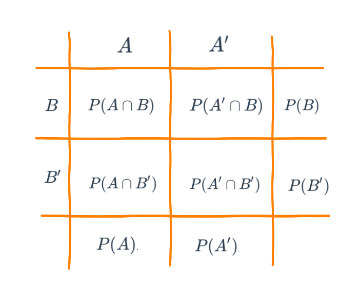

```{r setup, include=FALSE}
knitr::opts_chunk$set(comment = NA)

library(summarytools)
library(devtools)
# install_github("lchiffon/wordcloud2")
library(wordcloud)

# colores
c0= "#FFCC00"
c1= "#FFAD42"
c2= "#FF5A42"
c3= "#E1286F"
c4= "#4983F6"
c5= "#783AC7"
c6= "#2C5697" # AZZUL INSTITUCIONAL
c7= "#F7F7F7" # FONDO GRIS CLARO WEB

```


```{r, echo=FALSE, out.width="80%", fig.align = "left"}
 knitr::include_graphics("img/recursos2.png")
```


<br/><br/>

# **Recursos**

Antes de empezar con el tema reflexionemos sobre los siguientes interrogantes:

#### ¿Qué es la probabilidad?

#### ¿Cuál es su uso.....?

#### ¿Como se mide......?

#### ¿Que tipos de probabilidad existen?

#### ¿Qué propiedades posee....?

<br/><br/>

#### ¿Qué significado tienen las palabras...

##### Azar - Aleatorio

##### Determinístico - No deterministico

##### Incertidumbre - Probable - Improbable

##### Cierto - Incierto - Imposible

<br/><br/>

```{r, echo=FALSE, out.width="80%", fig.align = "center"}

#```{r, echo=FALSE, warning=FALSE, message=FALSE,  fig.height=8, fig.width=8}
# library("tm")
# library("SnowballC")
# library("wordcloud2")
# library("RColorBrewer")
# # nube1 <- read.csv("data/nube1.csv")
# 
# palabras=c("probabilidad", 
#            "azar", 
#            "aleatorio", 
#            "deterministico", 
#            "incertidumbre", 
#            "probable", 
#            "imposible", 
#            "cierto", 
#            "incierto", 
#            "clásico", 
#            "subjetivo", 
#            "frecuentista", 
#            "evento", 
#            "experimento", 
#            "conjunto", 
#            "unión", 
#            "interseción",
#            "conjunto",
#            "marginal",
#            "Pascal",
#            "Fermat",
#            "De Meré",
#            "Gauss",
#            "Laplace",
#            "Kolmogorov",
#            "riesgo", 
#            "decisión") # 27
# replicas=c(11,8,8,8,8,8,8,8,8,4,
#            4,4,4,4,4,4,4,4,4,6,
#            6,6,5,5,5,8,8)
# 
# nube1=rep(palabras, replicas)
# 
# t=data.frame(table(nube1))
# 
# dword=t[,1]
# dfreq=t[,2]
# #set.seed(1234)
# # wordcloud(words = dword, freq = dfreq, min.freq = 1,
# #            max.words=200, random.order=FALSE, rot.per=0.35, 
# #            colors=brewer.pal(8, "Dark2"))
#   
#   library(wordcloud2)
#   wordcloud2(data = t, size = 0.2, shape = "circle")

```

<br/><br/>

Muchos relacionamos el concepto de probabilidad con los dados, pues forma parte de su origen y de su desarrollo inicial a través de preguntas y situaciones imaginarias y de alguna forma modelables desde la matemáticas. Pero este concepto va mucho mas alla como lo veremos en esta unidad.

La probabilidad es un concepto que se empieza a trabajar en 1654 cuando, caballero de Mered solicita a B. Pascal le ayude a resolver un problema relacionado con juegos de mesa. En particular este caballero manifestaba que las Matemáticas presentaban un vacio, pues sus cálculos no coincidían con lo que pasaba en la realidad y como consecuencia de ellos perdía dinero en las apuestas que se presentaban en el juego. 

Encomendado Pascal de esta tarea empieza a compartir su trabajo con Fermat, matemático y de la correspondencia de estos dos brillantes matemáticos nace los principios y fundamentos de  lo que hoy conocemos como probabilidad

<br/><br/>


```{r, echo=FALSE, out.width="80%", fig.align = "center"}
knitr::include_graphics("img/pascal.png")
```

Con el fin de motivar la construcción de los conceptos principales del tema se plantean las siguientes situaciones :

<br/>

**Problema**

El siguiente problema fué planteado por el Caballero de Meré a Pascal quien lo consultó con Fermata y conforma una serie de situaciones que dan origen a soluciones que conforman los inicios del estudio de la Probabilidad (1654).

Los dados, tal y como los conocemos hoy  en día, se hicieron muy populares en la edad media.  En esta época un caballero llamado Chevalier de Mere propuso el siguiente problema: 
 			
Qué es más probable : 

+ Sacar al menos un seis en cuatro tiradas con un solo dado o  

+ Sacar al menos un doble seis en 24 tiradas con dos dados? 

El caballero  afirmaba que este problema generaba una solución matemática que difería de la observación empírica

Este problema se retoma mas adelante

Iniciaremos con algunos conceptos básicos que nos permiten la contribución de sus fundamentos.

[El problema de los dados del caballero de Meré: soluciones publicadas en el siglo XVII](http://materias.df.uba.ar/estadisticaa2019v/files/2019/02/El_caballero_de_Mere.pdf)

<br/><br/>

<center>

<br/>

Tomada : película El dorado 
</center>


<br/><br/>

## **Conceptos básicos**

<br/><br/>

<div style="padding: 15px; border: 1px solid transparent; border-color: transparent; margin-bottom: 20px; border-radius: 4px; color: #000000; background-color: #DAEDFE ; border-color: #000000;">

**Experimento aleatorio** 

Acción que puede ser replicada bajo las  mismas condiciones y cuyo resultado no se conoce por anticipado.

</div>

<br/><br/>

+ $E_{1}$: Lanzar una moneda dos veces y observar los resultados obtenidos en sus caras superiores 

+ $E_{2}$: Lanzar dos dados y observar la suma de los resultados superiores 

+ $E_{3}$: Realizar un examen de estadística y observar el resultado obtenido  

+ $E_{4}$: En una salida de campo, observo si se cumple o no, totalmente el objetivo planteado 

+ $E_{5}$: Observo el número total de ensayos de laboratorio exitosos en  20 intentos realizados.

<br/><br/>

<div style="padding: 15px; border: 1px solid transparent; border-color: transparent; margin-bottom: 20px; border-radius: 4px; color: #000000; background-color: #DAEDFE ; border-color: #000000;">

**Espacio muestral** 

Conjunto de todos los posibles valores que puede tomar el experimento aleatorio. Este conjunto se nombra conuna letra mayuscula $S$ o tambien con **$\Omega$**
</div>

<br/><br/>

+ $S_{1}$= $\{ (cc), (cs), (sc), (ss) \}$  
<br/>

:::: {style="display: flex;"}

::: {}

+ $\begin{equation*}
	S_{2}=\left\{
	\begin{array}{cccccc}
	&(1,1),(1,2),(1,3),(1,4),(1,5),(1,6)&\\
	&(2,1),(2,2),(2,3),(2,4),(2,5),(2,6)&\\
	&(3,1),(3,2),(3,3),(3,4),(3,5),(3,6)&\\
	&(4,1),(4,2),(4,3),(4,4),(4,5),(4,6)&\\
	&(5,1),(5,2),(5,3),(5,4),(5,5),(5,6)&\\
	&(6,1),(6,2),(6,3),(6,4),(6,5),(6,6)&
	\end{array}
	\right\}
	\end{equation*}$ 

:::

::: {}

```{r, echo=FALSE, out.width="100%", fig.align = "center"}
knitr::include_graphics("img/dados.png")
```
:::

::::

<br/>

+ $S_{3}$= $\{ x \in \mathbb{R} | 0 \leq x \leq 5   \}$ 

<br/>

+ $S_{4}$= $\{ x \in \mathbb{N}| 0 \leq x \leq 1 \}$ 

<br/>

+ $S_{5}$= $\{ x \in \mathbb{N}| 0 \leq x \leq 20 \}$

<br/><br/><br/>

<div style="padding: 15px; border: 1px solid transparent; border-color: transparent; margin-bottom: 20px; border-radius: 4px; color: #000000; background-color: #DAEDFE ; border-color: #000000;">

**Evento aleatorio** 

Subconjunto del espacio muestral que es de nuestro interés. Como todo conjunto se nombra con una letra mayúscula por lo general las primeras letras del alfabeto

</div>

<br/><br/>

|           |                                       |                      |
|:----------|:--------------------------------------|:---------------------|
|$A_{1}$    | Obtener solo caras                    | $A_{1}=\{ (c,c)\}$
| $A_{2}$   | Sacar un resultados es inferior a 4   | $A_{2}=\{(1,1),(1,2)(2,1)\}$
| $A_{3}$   | Ganar el examen                       | $A_{3}=\{ x \in \mathbb{R} | 3.0 \leq x \leq 5.0 \}$
| $A_{4}$   | Cumplir el objetivo de la salida      | $A_{4} =\{ 1 \}$
| $A_{5}$   | Obtener más de 5 ensayos éxitos       | $A_{5}$= $\{ x \in \mathbb{N}| 6 \leq x \leq 20 \}$

<br/><br/>


Resumiendo:

|Experimento aleatorio| Espacio muestral | Evento aleatorio |
|:--------------------|:-----------------|:-----------------|
|Lanzar una moneda dos veces y observar los resultados obtenidos en sus caras superiores| $S_{1}$= $\{ (cc), (cs), (sc), (ss) \}$ | Obtiener solo caras |
|Lanzar dos dados y observar la suma de los resultados superiores| $S_{2}$= $\{(1,1),(1,2), \dots, (6,6) \}$ | Sacar un resultados es inferior a 6 |
|Realizar un examen de estadística y observar el resultado obtenido|  $S_{3}$= $\{ x \in \mathbb{R} | 0 \leq x \leq 5 \}$| Ganar el examen|
|En una salida de campo, observo si se cumple o no, totalmente el objetivo planteado| $S_{4}$= $\{ x \in \mathbb{N}| 0 \leq x \leq 1 \}$| Cumplir el objetivo de la salida |
|Observo el número total de ensayos de laboratorio exitosos en  20 intentos realizados| $S_{5}$= $\{ x \in \mathbb{N}| 0 \leq x \leq 20 \}$| Obtener más de 5 ensayos éxitos |

<br/><br/><br/>

## **Enfoques de probabilidad**

<br/><br/><br/>

<div style="padding: 15px; border: 1px solid transparent; border-color: transparent; margin-bottom: 20px; border-radius: 4px; color: #000000; background-color: #DAEDFE  ; border-color: #000000;">

### **Enfoque clásico**  

Es el enfoque más antiguo de probabilidad y que está basado en el supuesto de eventos individuales igualmente probables. La probabilidad bajo ese enfoque para el evento $A$ se calcula como la fracción entre el número de elementos del conjunto $A$, $n(A)$ y el número de elementos del espacio muestral $n(S)$: 
		
$$P(A)=\dfrac{n(A)}{n(S)}$$

</div>
	
En el caso del evento $A_{1}=\{(c,c)\}$, su probabilidad se obtiene como: 

$P(A_{1}=\dfrac{n(A_{1})}{n(S_{1})}=\dfrac{1}{4}=0.25$ 

Para $A_{2}$, la suma de los resultados es inferior a 6, se obtiene de la siguiente forma

$P(A_{2})=\dfrac{n(A_{2})}{n(S_{2})}=\dfrac{9}{36}=0.25$

<br/><br/> 


En la gran mayoria de casos no se cumplen los supuestos anteriores, pues se tienen eventos que no son igualmente probables, lo cual impide que podamos utilizar el enfoque frecuentista. 

Ahora suponemos que lo ocurrió en el pasado segirá pasando y asi estudiando la información recogida podemos predecir la posibilidad de ocurrencia de un evento futuro

<br/><br/><br/>

<div style="padding: 15px; border: 1px solid transparent; border-color: transparent; margin-bottom: 20px; border-radius: 4px; color: #000000; background-color: #DAEDFE ; border-color: #000000;">

### **Enfoque Frecuentista**

Este enfoque basa su cálculo en la frecuencia con que ocurre un evento en un tamaño de muestra determinado $n$.

			
$$\lim_{n \to{+}\infty} P(A)=\Bigg[ \dfrac{\text{número de veces que ocurre A}}{n} \Bigg]$$

</div>

<br/><br/>

<center>

</center>

<br/><br/>

Si observamos el cobro de un penalti en un partido de fútbol, el cobrador tiene un gran número de posibilidades (lugares) para colocar el balón que podemos simplificar en 6 : parte baja derecha, parte alta derecha, parte baja al centro, parte alta central, parte baja izquierda y parte alta izquierda. Por su parte el arquero piensa también es estos lograres para evitar que el disparo termine en gol. Hoy en dia ambos jugadores estudian las frecuencias para determinar cual lugar ofrece mayores probabilidades de obtener éxito desde su rol.

<br/>

Para calcular la probabilidad de que un jugador ejecute y convierta gol, debemos utilizar el enfoque frecuentista, contando para ello información pasada y realizando una división entre el numero de aciertos sobre el numero total de cobros.

<br/>

Otro ejemplo puede estar relacionado con la probabilidad de muerte por Covid en Colombia. Es de aclarar que esta probabilidad no se mantiene constante a través del tiempo pues los efectos causados por la vacunación y su evolución hacen que esta probabilidad cambie. Por fines prácticos tomaremos la base total de colombianos infectados desde marzo del 2019 como denominador y como numerador el numero total de muertos

```{r, eval=FALSE}
Colombia=readRDS("data/Colombia22.RDS")
tabla=summarytools::freq(Colombia22$ubicacion, cumul = FALSE)
tabla
```

Con base en esta tabla podríamos pensar que la probabilidad de que una persona muera a causa del Covid-19 es del `0.0289`. Valor que se obtiene al dividir el número de personas fallecidas y el número total de personas que se han contraído covid. Claro bajo el supuesto de que todos las personas tenemos la misma probabilidad de fallecer. Hecho que se discutirá mas adelante.

<br/><br/><br/>

<div style="padding: 15px; border: 1px solid transparent; border-color: transparent; margin-bottom: 20px; border-radius: 4px; color: #000000; background-color: #DAEDFE ; border-color: #000000;">

### **Enfoque subjetivo** 

En este caso la probabilidad es valorada y asignada por un **EXPERTO**, como un médico, un ingeniero, un abogado, un economista, un biólogo, un estadístico ......

</div>

<br/><br/><br/>

## **Axiomas de  probabilidad**

<div style="padding: 15px; border: 1px solid transparent; border-color: transparent; margin-bottom: 20px; border-radius: 4px; color: #000000; background-color: #DAEDFE ; border-color: #000000;">

+ $A_{1}$ : Sea $S$ un espacio muestral  asociado a un experimento. Entonces:

$$P(S)=1$$ 

+ $A_{2}$ : Para cualquier evento $A$, se cumple que:

$$0 \leq P(A) \leq 1$$ 

+ $A_{3}$ : Si $A$ y $B$ son dos eventos mutuamente excluyentes, entonces: 
$$P(A \cup B) = P(A) + P(B)$$ 
En general 

$$P(A \cup B) = P(A)+ P(B) - P(A \cap B)$$ 


+ $A_{4}$ : Para cualquier evento $A$, $P(A')=1-P(A)$

+ $A_{5}$ : La probabilidad que no ocurra nada : 

$$P(\phi) = 0$$   

</div>

<br/><br/><br/>

## **Tipos de probabilidad**

<br/><br/>

:::: {style="display: flex;"}
::: {}

```{r, echo=FALSE, out.width="70%", fig.align = "center"}

```
  
:::
::: {}

```{r, echo=FALSE, out.width="70%", fig.align = "center"}
knitr::include_graphics("img/diagrama5_22.png")
```
:::
  
::::


<br/><br/>

### **Probabilidad simple o marginal**
			
+ $P(A)$ : probabilidad de que ocurra A 

+ $P(A')$ : probabilidad de que NO ocurra A 

+ $P(B)$ : probabilidad de que ocurra B 

+ $P(B')$ : probabilidad de que NO ocurra B 
			
<br/><br/><br/>

### **Probabilidad conjunta** 
			
+ $P(A \cap B)$ : probabilidad de que ocurra A y B 
			
+ $P(A' \cap B)$ : probabilidad de que NO ocurra A y ocurra B 

+ $P(A \cap B')$ : probabilidad de que ocurra A y NO ocurra B 

+ $P(A' \cap B')$ : probabilidad de que NO ocurra A ni B 

<br/><br/><br/><br/>


<div class="box2 with-label">
<div class="label">Ejemplo 1</div>  


```{r}
library(kableExtra)
x = c(180, 114, 145, 128, 162, 165, 43, 36, 27)
m=matrix(x, nrow = 3)
colnames(m) = c("incremento", "estables", "disminución")
rownames(m) = c("Facebook", "Instagram", "TicTok")

# Crear tabla bonita con kableExtra
# Instala los paquetes necesarios si no los tienes
#install.packages("kableExtra")


# Crear tabla con estilo y encabezado adicional "Ventas"
kable(m, format = "html", col.names = c("Incremento", "Estables", "Disminución")) %>%
  add_header_above(c(" " = 1, "Ventas" = 3)) %>%
  kable_styling(bootstrap_options = c("striped", "hover", "condensed", "responsive"),
                full_width = F, position = "center")


```

La tabla corresponde a los resultados obtenidos en un estudio de mercado sobre el efecto sobre las ventas de los medios digitales en los pautan un grupo de compañias 

Determine el conjunto de probabilidades simples o marginales y el conjunto de las probabilidades conjuntas.
En todos los casos escriba las probabilidades en forma simbolica y con palabras.

Represente los valores en un diagrama de Venn


</div>


<br/><br/><br/><br/>


<div class="box2 with-label">
<div class="label">Ejemplo 2</div>  


```{r}
# Cargar el paquete kableExtra
library(kableExtra)

# Datos ajustados para reflejar conteo por oficinas
set.seed(123)  # Para reproducibilidad
n <- 200  # Número de observaciones

# Generar valores aleatorios para los indicadores
productividad <- sample(60:100, n, replace = TRUE)      # Productividad simulada
cumplimiento <- sample(70:110, n, replace = TRUE)       # Cumplimiento de metas simulado
satisfaccion <- sample(75:105, n, replace = TRUE)       # Satisfacción del cliente simulada

# Crear un data frame simulando oficinas
oficinas <- c("CO", "PE", "BR", "EC", "AR")

# Crear el data frame final con los datos simulados
df <- data.frame(Oficina = oficinas, 
                 Productividad = productividad, 
                 Cumplimiento = cumplimiento, 
                 Satisfacción = satisfaccion)

# Mostrar tabla bonita con una muestra de las primeras 10 observaciones y encabezado
kable(head(df, 5), format = "html", col.names = c("Pais", "Productividad", "Cumplimiento", "Satisfacción")) %>%
  add_header_above(c(" " = 1, "Indicadores de desempeño tiendas por pais" = 3)) %>%
  kable_styling(bootstrap_options = c("striped", "hover", "condensed", "responsive"), 
                full_width = F, position = "center")

```


La tabla corresponde a la clasificación de los indicadores de desempeño de tiendas de la compañia SAT para cinco paises

Determine el conjunto de probabilidades simples o marginales y el conjunto de las probabilidades conjuntas.
En todos los casos escriba las probabilidades en forma simbolica y con palabras.


</div>