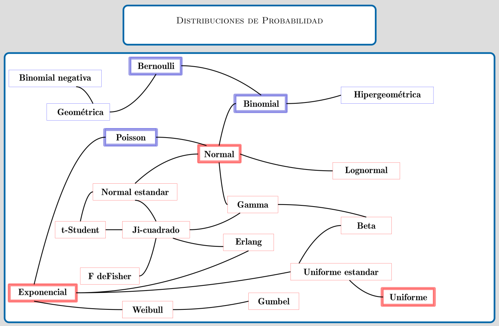

```{r setup, include=FALSE}
knitr::opts_chunk$set(comment = NA)

library(summarytools)
library(devtools)
# install_github("lchiffon/wordcloud2")
library(wordcloud)

# colores
c0= "#FFCC00"
c1= "#FFAD42"
c2= "#FF5A42"
c3= "#E1286F"
c4= "#4983F6"
c5= "#783AC7"
c6= "#2C5697" # AZZUL INSTITUCIONAL
c7= "#F7F7F7" # FONDO GRIS CLARO WEB

```


```{r, echo=FALSE, out.width="80%", fig.align = "left"}
 knitr::include_graphics("img/recursos2.png")
```


<br/><br/>

# **Modelos especiales**

<br/><br/>

A continuación se presentan los principales conceptos teóricos de esta unidad, acompañados de ejemplos resueltos. 

## **Introducción**

<br/><br/>

En las unidades abordadas previamente a esta se han trabajado las características de variables aleatorias tanto discretas como continuas dentro de  las cuales están: la función de distribución de probabilidad $f(x)$ , para el caso discreto y la función de densidad de probabilidad para las variables continuas. En ambos casos la función de probabilidad acumulada $F(x)$ que representa $P(X \leq x)$, el valor esperado $E[X]$, la varianza $V[X]$, y en el caso de las variables conjuntas la función de distribución conjunta y la función de densidad conjunta para los casos discreto-discreto y continuo-continuo, respectivamente $f_{_{XY}}(x,y)$. También característica de ellas como son: el valor esperado conjunto $E[XY]$ , la covarianza $Cov[XY]$ y el coeficiente de correlación  $\rho_{_{XY}}$ para las variables $X$ y $Y$. 

<br/><br/>
Ahora, el siguiente modelo :

$$f(x)= \frac{1}{50}e^{-(\frac{x}{50})} $$ 

<br/><br/>

Llamado exponencial, puede ser estudiado y asociado a sucesos que ocurren diariamente a nuestro alrededor.

Tener una variable cuyo comportamiento se puede caracterizar tiene la ventaja de conocer fácilmente el recorrido teórico en la construcción del modelo, las propiedades, tendencias, valor esperado, varianza, función de distribución, estimadores de sus parámetros, alternativas que facilitan el cálculo de probabilidades, su afinidad con otras variables, entre otras, características que facilitan actividades como la simulación. 

El siguiente diagrama presenta los principales modelo de probabilidad y sus diferentes relaciones

<br/><br/>


```{r, echo=FALSE, out.width="80%", fig.align = "center"}
 
```


Fuente: construcción propia. basado en Univariate Distribution Relationships  ([Lawrence M. LEEMIS and Jacquelyn T. MCQUESTON](http://www.math.wm.edu/~leemis/2008amstat.pdf))

<br/><br/>

# **Modelos discretos**

<br/><br/>

## **Algunos modelos discretos**	

<br/>

|                 |                 |                 |                 |                 |                 | 
|:---------------:|:---------------:|:---------------:|:---------------:|:---------------:|:---------------:|
| **Bernoulli**   | **Binomial**    | **Poisson**     | Hipergeométrico | Geométrico o de Pascal | Binomial negativo|
|                 |                 |                 |                 |                 |                 | 


A continuación se presentan los modelos más comunes con sus principales características:

<br/><br/>

Hemos clasificado como variables discretas aquellas cuyo rango $R_{X}$, corresponde a un conjunto de valores finito o infinito numerables. También es común que estas variables sean asociadas con el conteo, por lo que en su mayoría contienen la palabras **número de...**

A continuación se presentan los principales modelos discretos.

<br/><br/>

## **Distribución Bernoulli**

<br/>

Empezaremos  enunciando el modelo Bernoulli, aunque algunos autores no lo reconocen como modelo, ayuda en la compresión de los modelos siguientes. Toma  su nombre del matemático Jacob Bernoulli.

<br/><br/>

<div class="box2 with-label">
<div class="label">Distribución Bernoulli</div>
		
Una variable que se distribuye Bernoulli, procede de un experimento Bernoulli, descrito por las siguientes características:
	
* El experimento consta de un ensayo.

* El ensayo solo tiene dos posible resultados: éxito (E), fracaso (F).

* La probabilidad de éxito es $p$, la probabilidad de fracaso es $1-p=q$ 

La variable objeto de estudio es $X$: hay o no éxito éxitos en un ensayo de Bernoulli. Sus principales características son:

Rango : $R_{X}=\{0,1 \}$,
Función de distribución de probabilidad $

$$\begin{equation*}
		f(x)=\left\lbrace
		\begin{array}{lll}
			p & \mbox{si } x=1   \\
			q & \mbox{si } x=0
		\end{array}
		\right.
\end{equation*}$$

$$E[X]= p$$

$$V[X]= pq$$

</div> 

<br/><br/>

<div class="box1 with-label">
<div class="label">Ejemplo 1</div> 

Un gerente de ventas realiza una visita a diferentes empresas para presentar un nuevo producto. Se considera éxito si logra concretar una reunión con un decisor clave de la empresa y fracaso si no puede agendar la reunión. Con base en estudios previos de mercado, la probabilidad de lograr agendar una reunión se estima en 0.20.

El gerente desea saber la probabilidad de éxito al contactar a un conjunto de empresas durante su campaña.

</div>
<br/><br/>

**Solución** 

Se requiere examinar si dentro de este contexto existe una variable que provenga de un experimento de Bernoulli y cómo se podría caracterizar en términos administrativos.

Primero, es necesario revisar las características de un experimento de Bernoulli y confrontarlas contra el contexto presentado en el ejemplo.

En este caso, existe un solo intento de contactar a una empresa, durante el cual se pueden obtener dos resultados posibles: lograr concretar una reunión con el decisor clave (éxito) o no lograrlo (fracaso). Además, se posee la probabilidad de éxito ($0.20$), establecida mediante el análisis de estudios previos de mercado. Lo anterior nos permite poder asociar la variable que llamaremos $X$ con la capacidad o no de concretar la reunión.

La variable aleatoria se define en este caso como:

$$X =\left\lbrace
\begin{array}{lll}
	1 & \mbox{si logra concretar una reunión con el decisor clave (éxito)}   \\
	0 & \mbox{si no logra concretar una reunión con el decisor clave (fracaso)}
\end{array}
\right.$$

y su función de distribución de probabilidad está dada por:

$$f(x)= 0.2^{x} (1-0.2)^{1-x} ,\text{ si } x=0,1.$$
$$E[X]=p =0.20$$ 

$$V[X] =p(1-p)= 0.16$$
<br/><br/>


## **Distribución binomial** 

<br/>

El segundo modelo que abordaremos corresponde al modelo binomial, que puede verse como una generalización del modelo Bernoulli, pasando de un ensayo a $n$ ensayos. Fue investigada y analizada por el físico y matemático suizo Jakob Bernoulli en relación con problemas presentados en los juegos de azar. Su trabajo fue presentado en 1713. 

<br/>

<div class="box2 with-label">
<div class="label">Distribución binomial</div>
	
Una variable con distribución binomial es aquella que procede de un experimento binomial. 
	
Ahora un experimento binomial tiene las siguientes características: 
	
* El experimento consta de $n$ ensayos 

* Cada ensayo tiene solo dos posible resultados: éxito (E) o fracaso (F) (experimento Bernoulli),

* La probabilidad de éxito es igual a $p$ y se mantiene fija para todos los ensayos P(E). La probabilidad de fracaso es $(1-p)=q$,

* Los ensayos son independientes,

* La variable objeto de estudio $X$, corresponde al **número de éxitos obtenidos en los $n$ ensayos**.

* Se puede decir que la suma de $n$ variables independientes con distribución Bernoulli($p$), se distribuye de manera Bionomial($n,p$)
	
La función de distribución de probabilidad está dada por:
	
$$\begin{equation*}
		f(x)=\left\lbrace
		\begin{array}{lll}
			\displaystyle\binom{n}{x} p^{x} (1-p)^{n-x} &,& x=0,1,2, \ldots, n   \\
			&&\\
			0 &,& \mbox{en otro caso}
		\end{array}
		\right.
 \end{equation*}$$
	
$$E[X]=np$$

$$V[X]= np(1-p) $$

</div> 


```{r, echo=FALSE, fig.height=3.5, fig.align='center'}
library(ggplot2)
# modelo binomial  ok
x=0:9
fx=dbinom(x,9,0.90)
dat=data.frame(x,fx)


ggplot(dat) + geom_point(aes(x, fx),colour = c2, size = 2) +
  scale_x_continuous(limits = c(0, 10),
                     breaks = c(0,1,2,3,4,5,6,7,8,9), 
                     labels = c('0','1','2','3','4','5','6','7','8','9'))
```

<br/><br/>


<div class="box1 with-label">
<div class="label">Ejemplo 2</div> 

Una empresa ha lanzado una campaña de marketing para promocionar su nuevo software de gestión de clientes (CRM), y la efectividad de esta campaña se ha estimado en un 90% en cuanto a captar el interés de los clientes potenciales. Supongamos que la campaña fue presentación a nueve empresas diferentes. Se requiere calcular la probabilidad de que exactamente siete de estas empresas muestren interés en el producto y acepten una reunión de demostración con el equipo de técnico de la empresa.
</div>

<br/><br/>

**Solución**

En este caso la variable $X$ se define como el número de empresas que 
muestren interés en el producto y acepten una reunión de demostración con el equipo de técnico de la empresa.
Observe que en cada caso se puede presentar dos posibles resultados frente a la tentativa de robo : 

* Muestran interés en el producto y acepten una reunión de demostración con el equipo de técnico de la empresa o que no muestran interés en el producto, los cuales conforman los eventos de exito (E) y fracaso (F).

* Las empresas conforman eventos independiente y se pueden considerar como idénticos, dado que todas tienen la misma necesidad.

* La probabilidad de que 
una empresa muestre interes en el software es 
de 0.9 ($p$) y mientras que no muestre interes es de 0.1 ($q$)

* Se tienen nueve empresas, que representaría la realización de nueve ensayos, bajo las mismas condiciones.

Por las anteriores razones, el proceso enunciado corresponde a un experimento binomial y por tanto podemos afirmar que la variable X: número de em`resas que muesrtan interes en el software, corresponde a una variable con distribución binomial con parámetros $n=9$ y $p=0.90$.

Para calcular la probabilidad requerida utilizamos la función de distribución de probabilidad del modelo Binomial

$$\begin{equation*}
	\begin{array}{lcl}
		f(7) = P(X=7)&=& \displaystyle\binom{9}{7} 0.90^{7} 0.10^{2} \\
		&=& 0.17218688 
	\end{array}
\end{equation*}$$


<br/><br/>

En R se corre el siguiente código:

```{r}
 dbinom(7,9,0.90)
```

<br/><br/>

La siguiente gráfica corresponde a la función de distribución de probabilidad del ejemplo2 :binomial con $n=9$ y $p=0.90$

Distribución binomial $n=9$, $p=0.90$


```{r, echo=FALSE, fig.height=3.5, fig.align='center'}
library(ggplot2)
# modelo binomial  ok
x=0:9
fx=dbinom(x,9,0.90)
dat=data.frame(x,fx)


ggplot(dat) + geom_point(aes(x, fx),colour = c2, size = 2) +
  scale_x_continuous(limits = c(0, 10),
                     breaks = c(0,1,2,3,4,5,6,7,8,9), 
                     labels = c('0','1','2','3','4','5','6','7','8','9'))
```


<br/><br/>


## **Distribución Poisson**

<br/>

El siguiente modelo fue plantea por el físico y matemático francés Siméon-Denis Poissonen uno de sus trabajos presentado en 1838 relacionado con temas sobre juicios en temas criminales y civiles. Es  utilizado para resolver problemas asociados con el número de eventos que ocurren en un intervalo de tiempo o espacio, como por ejemplo:

* número de llamadas que recibe un conmutador durante una hora

* número de plaquetas por $mm^{3}$ de sangre

* número de servicios técnicos solicitados por día

* número de imperfecciones por $m^{2}$  de carretera

<br/>

<div class="box2 with-label">
<div class="label">Distribución Poisson</div>
	
La función de distribución de probabilidad de una variable con distribución Poisson esta dada por siguiente la expresión:
	
$\begin{equation*}
		f(x)=\left\lbrace
		\begin{array}{lll}
			\dfrac{\lambda^{x}}{x!} \hspace{.2cm} e^{-\lambda} &,& x \geq 0   \\
			&&\\
			0 &,& \mbox{en otro caso}
		\end{array}
		\right.
	\end{equation*}$
	
Donde $\lambda$ es la cantidad promedio de ocurrencias en el periodo de interés.
	
$$E[X]=\lambda$$

$$V[X]=\lambda $$
La variable objeto de estudio $X$ es el **número de eventos que ocurren por unidad de tiempo, longitud, superficie o volumen**

</div> 
La siguiente gráfica representa la distribución de masa de una variable de Poisson con media 2.

**Distribución Poisson ($\lambda=2$)**

```{r, echo=FALSE, fig.height=3.5, fig.align='center'}
# poiss ok
library(ggplot2)
x=0:10
fx=dpois(x,2)
dat=data.frame(x,fx)


ggplot(dat) + geom_point(aes(x, fx),colour = c2, size = 2) +
  scale_x_continuous(limits = c(0, 10),
                     breaks = c(0,1,2,3,4,5,6,7,8,9,10), 
                     labels = c('0','1','2','3','4','5','6','7','8','9','10'))
```

<br/><br/>

	
<div class="box1 with-label">
<div class="label">Ejemplo 3</div> 

Se estima que en el cruce más importante de la cuidad, ocurren 2 accidentes por día y se desea valorar la probabilidad de que en un día cualquiera no ocurra ningún accidente en dicho cruce. 

</div>

<br/><br/>

**Solución**

El número de accidentes que pueden ocurrir en este cruce, para un dia cualquiera, se puede considerar como una variable aleatoria con distribución Poisson, pues la variable hace referencia al número de eventos que se pueden presentar en un determinado espacio de tiempo. 
Para calcular la probabilidad de que no ocurra ningún evento, utilizamos el modelo Poisson:

$$f(0) = P(X = 0) = \dfrac{2^{0}}{0!} \hspace{.2cm} e^{-2}=0.135335$$

```{r}
dpois(0,2)
```


<br/><br/><br/>


# **Modelos continuos**

<br/><br/>

## **Algunos modelos continuos**

Las variables continuas proceden en su mayoría de la medición y se clasifican así debido a que su rango esta formado por un conjunto infinito no numerable. 
<br/>

|                 |                 |                 |                 |                 |                 | 
|:---------------:|:---------------:|:---------------:|:---------------:|:---------------:|:---------------:|
| **Uniforme**        |   **Normal**        |  **Exponencial**    |  Gamma          |  Weibull        | Cauchy          |
| Lognormal       |   Beta          | Erlang          |  Gumbel         |  Kernel	        |                 |
|                 |                 |                 |                 |                 |                 |


<br/><br/>

A continuación se presentan los principales modelos continuos.


## **uniforme**

<br/>

<div class="box2 with-label">
<div class="label">Distribución uniforme</div>
	
Se caracteriza porque su función de densidad es constante en su recorrido o dominio de definición (intervalo [a,b])

$$\begin{equation*}
		f(x)=\left\lbrace
		\begin{array}{lll}
			\dfrac{1}{b-a}	 &,& a \leq x \leq b   \\
			&&\\
			0 &,& \mbox{en otro caso}
		\end{array}
		\right.
	\end{equation*}$$

</div> 

<br/><br/>

**Distribución uniforme ($0,1$)**

```{r, echo=FALSE, fig.height=3.5, warning=FALSE, message=FALSE, fig.align='center'}
# uniforme
library(ggplot2)
x= c(0.95,1.05) 
fx=c(1,1) 
dat=data.frame(x,fx)
ggplot(data=dat,aes(x=x, y=fx))+ 
  scale_y_continuous(limits=c(0,1.2))+
  geom_line(size = 1, color= c2) 
```


<div class="box1 with-label">
<div class="label">Ejemplo 4</div> 

Una empresa de producción de tabletas de chocolate gourmet se enfoca en garantizar la uniformidad del grosor de sus productos para cumplir con los estándares de calidad. Cada tableta se fabrica con un grosor nominal de 1 cm, pero debido a variaciones en el proceso de producción, el grosor real ($X$) puede variar uniformemente entre 0,95 cm y 1,05 cm. Una de las preocupaciones del departamento de calidad es evitar que las tabletas sean demasiado gruesas, ya que esto podría generar un incremento en los costos de insumos y empa.

Se requiere calcular la probabilidad de que una tableta seleccionada al azar tenga un grosor superior a 1.|          

</div>

<br/><br/>

**Solución** 

 $$P(X\geq 1.03)= (1.05-1.03) \times \frac{1}{0.10}=0.20 $$

<br/><br/>

## **Distribución normal**

La distribución normal es uno de los modelos más utilizados en las aplicaciones de la Estadística. Estas aplicaciones están relacionadas con:

Usos de la distribución normal

* La mayoría de variables en la naturaleza, se distribuyen aproximadamente de manera normal

* A partir de la distribución normal se originan las distribuciones $t-student$, $\chi^{2}$ y $F$-Fisher, utilizadas en inferencia estadística

* En general la media muestral de variables que no tienen distribución normal, tiende a aproximarse a una distribución normal, a medida que el tamaño de muestra aumenta. (Teorema del Límite Central) 

* La regla empírica establece que:

    *	Aproximadamente el 68\% de la población se encuentra en el intervalo centrado $$(\mu - \sigma ; \mu + \sigma)$$

		* Aproximadamente el 95\% de la población se encuentra en el intervalo centrado $$(\mu - 2\sigma ; \mu + 2\sigma)$$

		* Aproximadamente el 99.7\% de la población se encuentra en el intervalo centrado $$(\mu - 3\sigma ; \mu + 3\sigma)$$

Su distribución fué planteada por el matemático francés del siglo 18, Abraham de Moivre, quien a partir de la distribución Binomial, con $n=2$ empezó a aumentar su tamaño hasta observar que se formaba una distribución en forma de campana. Este mismo comportamiento fué detectado por Galileo en el siglo 17, al observar los errores producto de sus mediciones en astronomía. El modelo como se conoce actualmente fue propuesto de manera simultánea por los cientificos Robert Adrain y Carl Friedrich Gauss, quien finalmente le dió el nombre.

Su función de densidad esta dada por:

<br/>

<div class="box2 with-label">
<div class="label">Distribución normal</div>
	
$$f(x)= \dfrac{1}{\sqrt{2\pi \sigma^{2}}} \hspace{.1cm} e^{-\big(\frac{1}{2\sigma^{2}}(x-\mu)^{2}\big)}	 \hspace{.5cm}  -\infty \leq  x \leq \infty $$  
	
$$E[X]=\mu$$
$$V[X]=\sigma^{2}$$

</div> 


<br/><br/>

En la siguente gráfica se muestra el efecto en la curva normal, producto de cambios en la media o en la varianza. A mayor valor de la media la curva se desplaza a la derecha, mientras que a menor varianza la curva se vuelve mas angosta o puntiaguda 

Distribuciones normales : <span style="color:#2C5697">$N(0,1)$</span>, <span style="color:#E1286F"> $N(0,1.5)$</span> y <span style="color:#FFAD42"> $N(2,1.5)$</span>

```{r, echo=FALSE, fig.height=3.5, fig.align='center'}
# Distribucion normal
library(ggfortify)

p=ggdistribution(dnorm, seq(-4, 8, 0.1), mean = 0, sd = 1,colour = c6)
p=ggdistribution(dnorm, seq(-4, 8, 0.1), mean = 0, sd = 1.5,colour = c3, p=p)
ggdistribution(dnorm, seq(-4, 8, 0.1),   mean = 2, sd = 1.5,colour = c1, p=p)
```


Dentro del sin número de posibles curvas que se pueden obtener con los parámetros $\mu$ y $\sigma^{2}$, existe una muy especial. Normal estándar ($N(0,1)$) con $\mu=0$ y $\sigma^{2}=1$.  La gran mayoría de libros de Estadística poseen tablas de la función de distribución acumulada de la normal estándar.\\


<div class="box2 with-label">
<div class="label">Distribución normal estandar N(0,1)</div>

Su función de distribución esta dada por :

$$f(x)= \dfrac{1}{\sqrt{2\pi}} \hspace{.1cm} e^{-\big(\frac{1}{2}(x)^{2}\big)}	 \hspace{.5cm}  -\infty \leq  x \leq \infty $$ 

Si $X \sim N(\mu, \sigma^{2})$, entonces $Z= \dfrac{X-\mu}{\sigma} \sim N(0,1)$ 

a este proceso se le llama comúnmente estandarizar.

</div> 

<br/><br/>


```{r, echo=FALSE, fig.height=3.5, fig.align='center'}
library(ggfortify)
ggdistribution(dnorm, seq(-3.6, 3.5, 0.1), mean = 0, sd = 1,fill = c6)
```

<br/><br/>


La propiedad empírica de la distribución normal es de gran ayuda cuando una variable  de interés se  puede aproximar al modelo normal. Ella establece un intervalo formado por la media mas o menos una desviación estándar contiene el 68\% de los datos. Si el intervalo tiene un ancho de 4 desviaciones estándar contendrá el 95\% de los datos y si este intervalo corresponde a los valores de la media mas o menos 3 desviaciones estándar contendrá el 99\% de los datos que se representa en la siguiente gráfica.


<div class="box2 with-label">
<div class="label">Propiedad empírica de la distribución normal estandar</div>

* $P(\mu - \sigma \leq X \leq \mu + \sigma) = 0.68$
* $P(\mu - 2\sigma \leq X \leq \mu + 2\sigma) = 0.95$
* $P(\mu - 3\sigma \leq X \leq \mu + 3\sigma) = 0.99$

<br/><br/>


```{r, echo=FALSE, out.width="60%", fig.align = "left", fig.align='center'}
 knitr::include_graphics("img/norm01.png")
```


</div>

<br/><br/>

<div class="box1 with-label">
<div class="label">Ejemplo 5</div>  
El tiempo que tarda un gerente en revisar y aprobar solicitudes de reembolso para los empleados se distribuye normalmente con una media de 60 minutos y una desviación estándar de 4 minutos. Debido a la alta carga de trabajo, la gerencia desea calcular la probabilidad de que una solicitud específica se apruebe en un tiempo de 70 minutos o más, con el fin de evaluar si es necesario implementar mejoras en el proceso de aprobación.

</div>

<br/><br/>

**Solución** 

Para una variable $X$ con distribución $N(60,16)$, debemos calcular la probabilidad $P(X \geq 70)$ \\

$$\begin{eqnarray*}
	P(X \geq 70)&=&P\Bigg(\dfrac{X-\mu}{\sigma} \geq \dfrac{70-60}{4}\Bigg)\\
	&=& P\Bigg(Z \geq \dfrac{70-60}{4}\Bigg)\\
	&=& P(Z\geq 2.5)=1-P(Z < 2.5 )\\
	&=& 1-0.9938=0.0062
\end{eqnarray*}$$

<br/><br/>

```{r, echo=FALSE, fig.height=3.5, fig.align='center'}
# Instalar librerías si no están instaladas
if(!require(ggplot2)) install.packages("ggplot2")
if(!require(ggfortify)) install.packages("ggfortify")

# Cargar librerías necesarias
library(ggplot2)
library(ggfortify)

# Definir los parámetros de la distribución
media <- 60  # Media de la distribución
desviacion <- 4  # Desviación estándar

# Crear un data frame con valores para la distribución normal
x_vals <- seq(media - 4 * desviacion, media + 4 * desviacion, length.out = 100)
y_vals <- dnorm(x_vals, mean = media, sd = desviacion)
data <- data.frame(x = x_vals, y = y_vals)

# Calcular el área bajo la curva a partir de 70 minutos
x_shade <- seq(70, max(x_vals), length.out = 100)
y_shade <- dnorm(x_shade, mean = media, sd = desviacion)
data_shade <- data.frame(x = x_shade, y = y_shade)

# Crear el gráfico con ggplot2 y ggfortify
ggplot(data, aes(x = x, y = y)) +
  geom_line(color = "blue", size = 1) +  # Línea de la distribución
  geom_area(data = data_shade, aes(x = x, y = y), fill = c6, alpha = 0.4) +  # Área sombreada para > 70
  geom_vline(xintercept = 70, linetype = "dashed", color = "#696969") +  # Línea vertical en 70
  labs(title = "Distribución Normal de Tiempo de Aprobación de Solicitudes",
       x = "Tiempo de aprobación (minutos)",
       y = "Densidad") +
  theme_minimal()

```


<br/><br/>

En R se utiliza el siguiente código: 

```{r }
pnorm(70, mean=60, sd=4, lower.tail=FALSE)
```

<br/><br/>

<div class="box3 with-label">
<div class="label">Nota: </div>

Para la solución del problema se puede tambien emplear la tabla de la distribución normal estandar

</div>

<br/><br/>


## **exponencial** 

Este modelo fue  planteado por el matemático estadístico e ingeniero Agner Kraru Erlang, experto en el trafico de las comunicaciones y la teoría de colas. 
Distribución utilizada para modelar el tiempo entre dos eventos consecutivos. 


<br/>

<div class="box2 with-label">
<div class="label">Distribución exponencial</div>
	
$$\begin{equation*}
		f(x)=\left\lbrace
		\begin{array}{lll}
			\lambda e^{-\lambda x}  &,& x > 0   \\
			&&\\
			0 &,& x \leq 0 
		\end{array}
		\right.
	\end{equation*}$$
	
	
$$E[X]=\dfrac{1}{\lambda}$$
	
$$V[X]=\dfrac{1}{\lambda^{2}}$$
	
Observación: algunos autores utilizan $\frac{1}{\beta}$ en lugar de $\lambda$
	
$$F(x)=P(X \leq x)=1-e^{-\lambda x} \hspace{1cm} x > 0$$

</div> 

<br/><br/>


Distribuciones exponenciales : <span style="color:#2C5697"> $exp(1)$</span>, <span style="color:#E1286F"> $exp(2)$</span> y <span style="color:#FFAD42"> $exp(5)$</span>

```{r, echo=FALSE, fig.height=3.5, fig.align='center'}
#exponencial
library(ggfortify)
p=ggdistribution(dexp, seq(0, 10, 0.1),rate=1 ,colour = c6)
p=ggdistribution(dexp, seq(0, 10, 0.1),rate=2 ,colour = c3, p=p)
ggdistribution(dexp, seq(0, 10, 0.1),rate=0.5,colour = c1, p=p)
```
 
<br/><br/>

### **Distribuciones exponenciales acumuladas**


```{r, echo=FALSE, fig.height=3.5, fig.align='center'}
library(ggfortify)
ggdistribution(pexp, seq(0, 10, 0.1),rate=1 ,colour = c6)
```

$$F(x)=P(X \leq x)=1-\exp\{-\lambda x\} \hspace{1cm} x > 0$$


<br/><br/>

<div class="box1 with-label">
<div class="label">Ejemplo 6</div> 

El tiempo entre llamadas de los clientes a una empresa de turismo ecológico tiene una distribución exponencial con un tiempo medio entre llamadas de 15 minutos. ¿Cuál es la probabilidad de que transcurra más de 20 minutos antes de que se realiza una nueva llamada? (Ejemplo 8 4-77 Mongomery) 

</div>

<br/><br/>

**Solución**

$X$: el tiempo entre dos llamadas consecutivas $\lambda=\frac{1}{15}$ minutos. 

$$\begin{eqnarray}
	P(X \geq 20) &=& 1-P(X < 20) \\
	&=& 1-(1-e^{-\frac{20}{15}}) \\
	&=& 0.2636 
\end{eqnarray}$$

En R se utiliza el siguiente código: 

```{r}
 pexp(20,1/15, lower.tail=FALSE)
```
